<p align="center">
  
</p>

<h1 align="center">groupbase</h1>

<p align="center">
  <b>Сайт и приложение для учебной группы, которые работают на компьютере старосты.</b><br>
  Домашние задания, новости, файлы и чаты группы в одном месте: с телефона, с компьютера и даже без
  интернета. Без серверов, подписок и чужих облаков: данные группы хранятся только у неё.
</p>

<p align="center">
  <a href="https://github.com/mitaro-cs/StorageSystem/releases/latest"></a>
  <a href="https://github.com/mitaro-cs/StorageSystem/actions/workflows/ci.yml"></a>
  
  
  <a href="LICENSE"></a>
</p>

<p align="center">
  <a href="https://github.com/mitaro-cs/StorageSystem/releases/latest"><b>Скачать для Windows и macOS</b></a> ·
  <a href="#быстрый-старт">Быстрый старт</a> ·
  <a href="docs/desktop.md">Инструкция для хоста</a> ·
  <a href="#частые-вопросы">Вопросы</a> ·
  <a href="CHANGELOG.md">Что нового</a>
</p>

<p align="center">
  <picture>
    <source media="(prefers-color-scheme: dark)" srcset="docs/screenshots/desktop-today-dark.webp">
    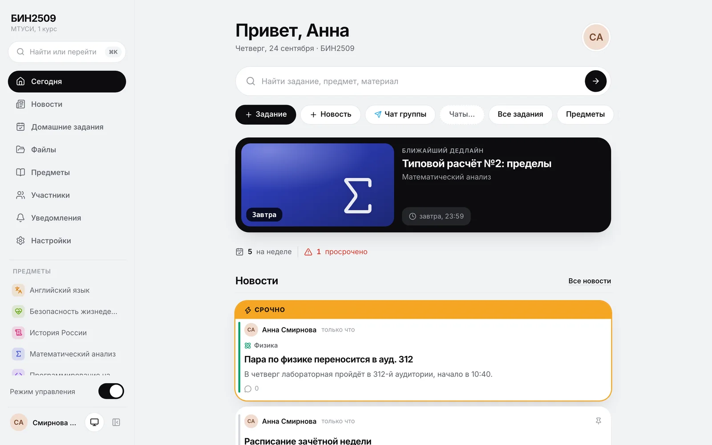
  </picture>
</p>

---

## Зачем

В группе всё обычно разбросано. Задания лежат в чате, методички — в облаке у старосты, перенос пары
тонет в сообщениях за вечер. groupbase собирает всё в одно место:

<table>
  <tr>
    <td width="33%" valign="top">
      <h3>🎓 Студенту</h3>
      <ul>
        <li>сразу видно, <b>что сдать и когда</b></li>
        <li>файлы открываются <b>прямо в приложении</b></li>
        <li>всё работает <b>без интернета</b></li>
        <li>push <b>о новом задании и за сутки до срока</b></li>
      </ul>
    </td>
    <td width="33%" valign="top">
      <h3>📣 Старосте</h3>
      <ul>
        <li>задание с файлами — <b>в пару касаний</b></li>
        <li>добавить человека — <b>ФИО и QR-код</b></li>
        <li>предметы с <b>иконками</b>, чаты Telegram</li>
        <li>роли, права, модерация, архив группы</li>
      </ul>
    </td>
    <td width="33%" valign="top">
      <h3>💻 Хосту</h3>
      <ul>
        <li>скачал, установил, <b>«Открыть доступ»</b></li>
        <li>бесплатная ссылка, <b>работает с VPN и без</b></li>
        <li><b>резервные копии</b> в своё облако</li>
        <li><b>обновление одной кнопкой</b></li>
      </ul>
    </td>
  </tr>
</table>

## Как это работает

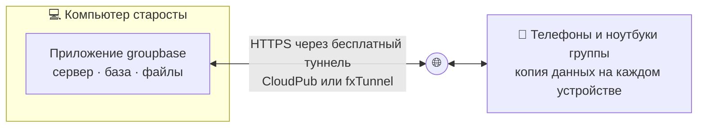

1. **Староста (хост)** ставит приложение на свой Windows или Mac: внутри сразу работает сервер группы.
2. **Кнопкой «Открыть доступ»** сайт получает постоянную ссылку `https://….cloudpub.ru`. Ни домена, ни
   сервера, ни денег не нужно.
3. **Одногруппники** открывают ссылку или QR-код, входят и ставят сайт на экран «Домой» как
   приложение.
4. **Когда компьютер старосты выключен**, у всех остаётся сохранённое. Можно читать, отмечать и даже
   публиковать — всё отправится, когда сервер снова включится.

## Скриншоты

<table>
  <tr>
    <td width="33%"><picture><source media="(prefers-color-scheme: dark)" srcset="docs/screenshots/mobile-today-dark.webp">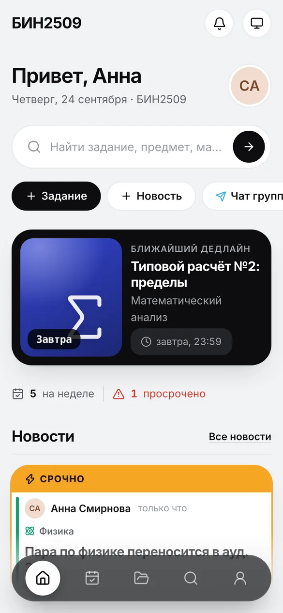</picture></td>
    <td width="33%">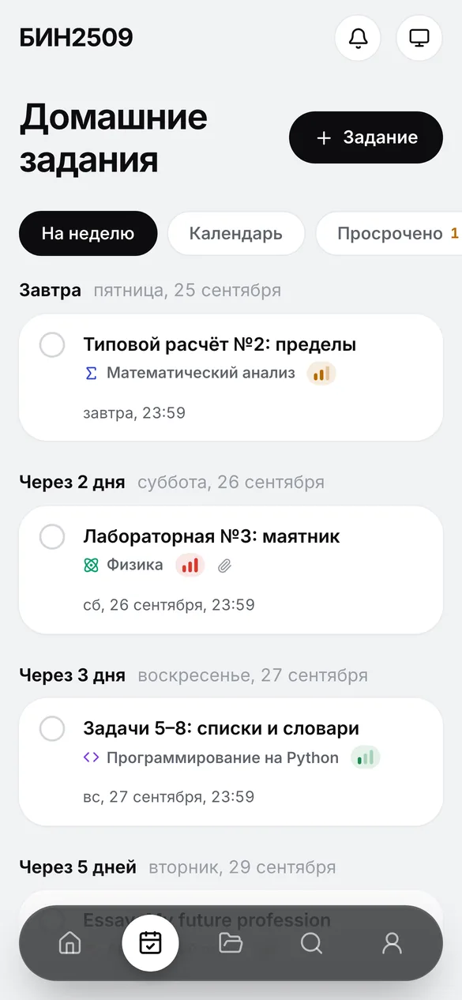</td>
    <td width="33%">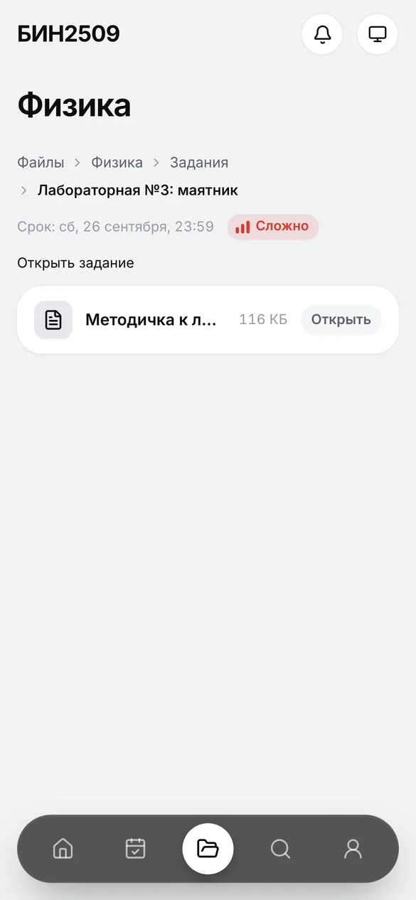</td>
  </tr>
  <tr>
    <td align="center"><b>«Сегодня»</b><br><sub>ближайший дедлайн и срочные новости</sub></td>
    <td align="center"><b>Задания по дням</b><br><sub>сложность, файлы, отметка «сделано»</sub></td>
    <td align="center"><b>Файлы с путём</b><br><sub>Файлы › Физика › Задания › …</sub></td>
  </tr>
  <tr>
    <td>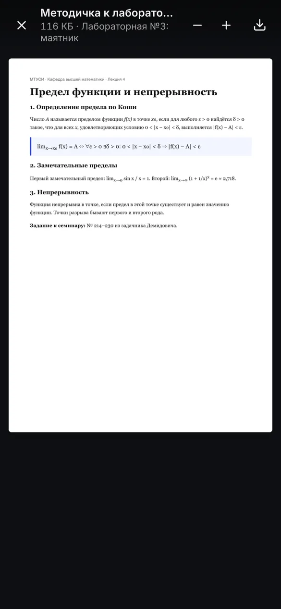</td>
    <td>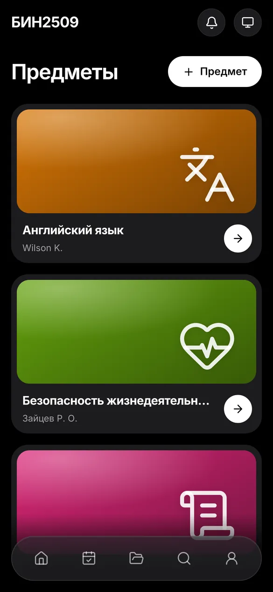</td>
    <td>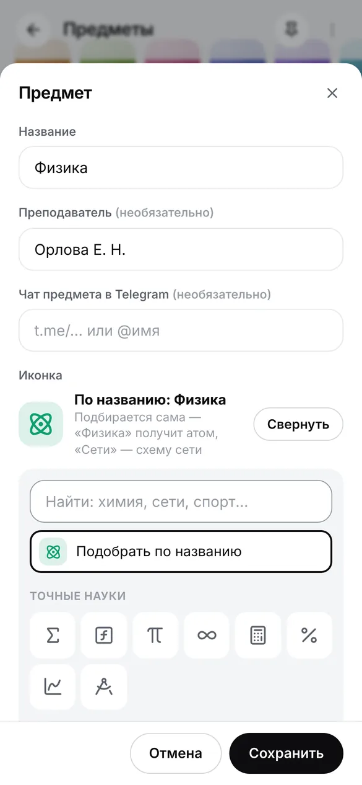</td>
  </tr>
  <tr>
    <td align="center"><b>Просмотр файлов</b><br><sub>PDF, фото, видео — без скачивания</sub></td>
    <td align="center"><b>Предметы</b><br><sub>светлая и тёмная тема</sub></td>
    <td align="center"><b>80 иконок предметов</b><br><sub>или подбор по названию</sub></td>
  </tr>
  <tr>
    <td>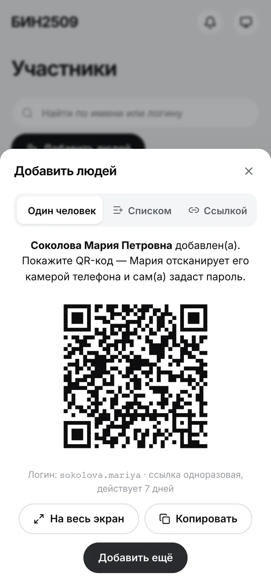</td>
    <td>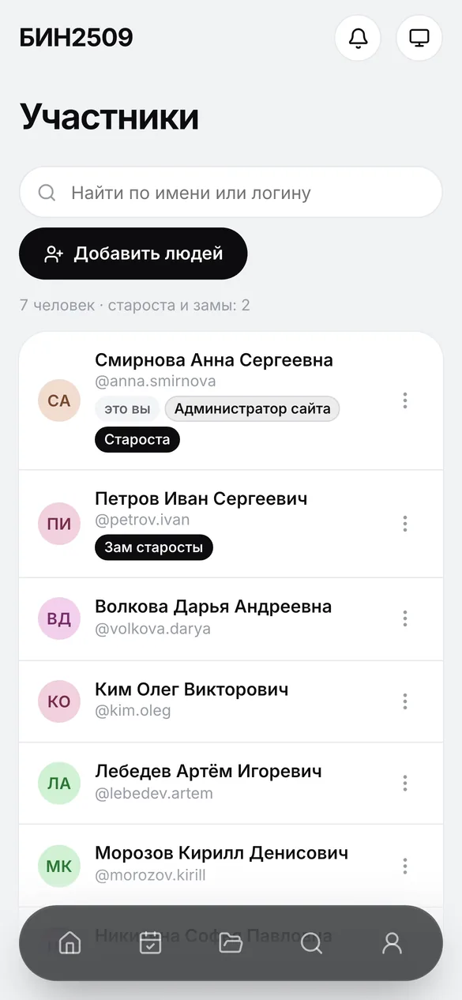</td>
    <td>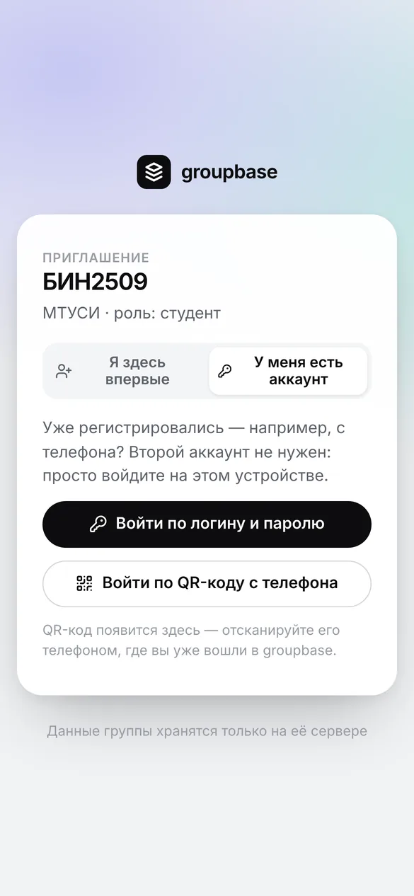</td>
  </tr>
  <tr>
    <td align="center"><b>Добавить людей</b><br><sub>вписал ФИО — показал QR-код</sub></td>
    <td align="center"><b>Люди и роли</b><br><sub>староста, замы, модераторы</sub></td>
    <td align="center"><b>Второе устройство</b><br><sub>«У меня есть аккаунт» — и вход</sub></td>
  </tr>
  <tr>
    <td>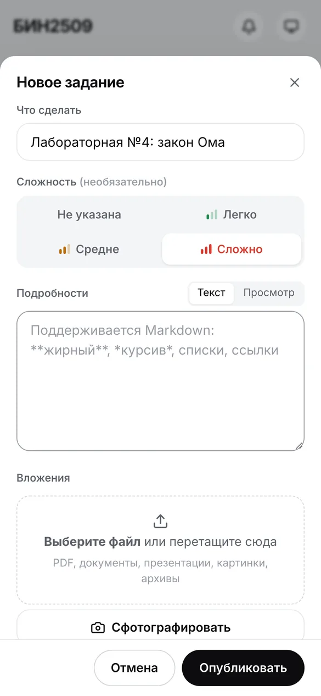</td>
    <td>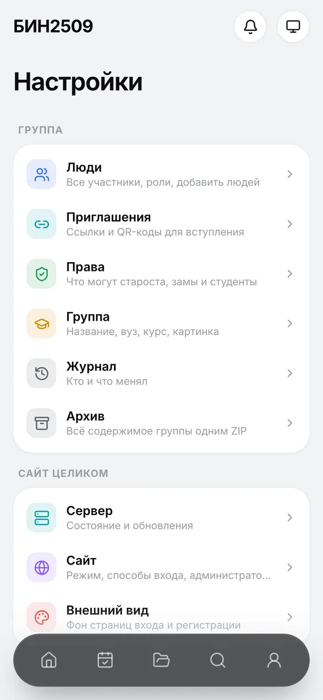</td>
    <td>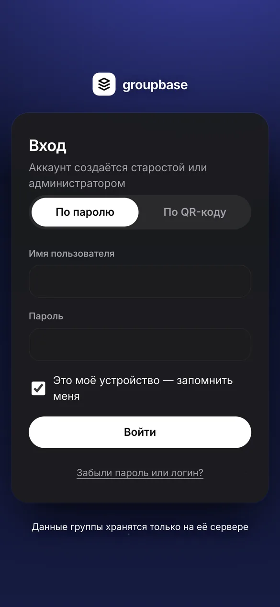</td>
  </tr>
  <tr>
    <td align="center"><b>Новое задание</b><br><sub>ДЗ, лабораторная, контрольная, зачёт, экзамен</sub></td>
    <td align="center"><b>Понятные настройки</b><br><sub>разделы с пояснениями</sub></td>
    <td align="center"><b>Свой фон входа</b><br><sub>рисунок или фото группы</sub></td>
  </tr>
  <tr>
    <td>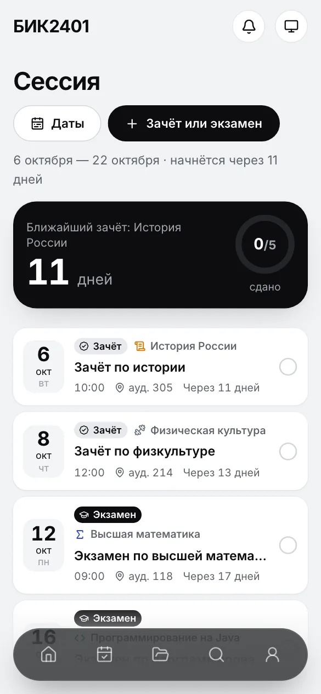</td>
    <td>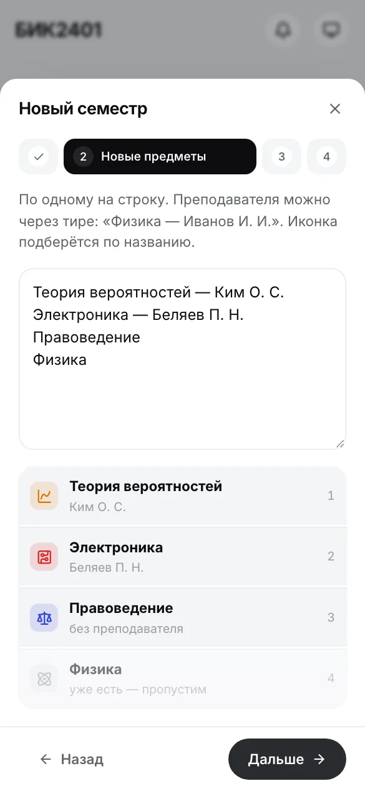</td>
    <td>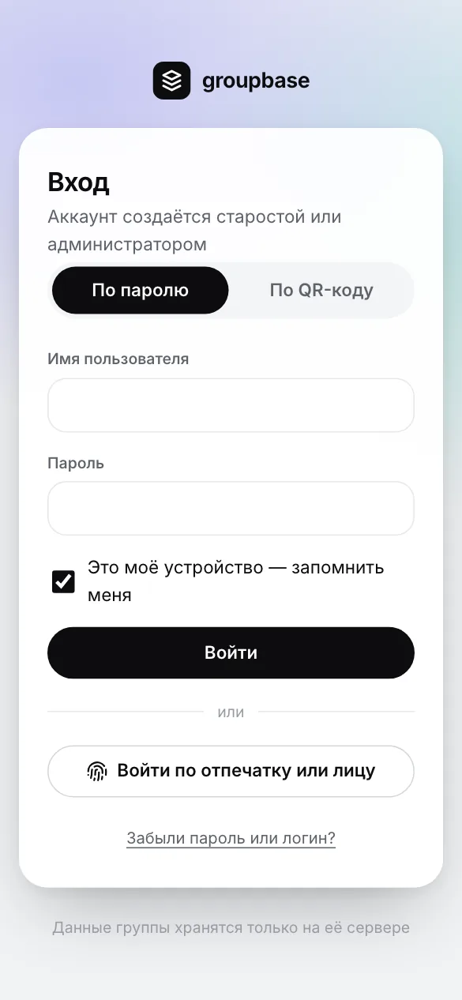</td>
  </tr>
  <tr>
    <td align="center"><b>Сессия</b><br><sub>отсчёт до экзамена, аудитория, «сдано»</sub></td>
    <td align="center"><b>Новый семестр</b><br><sub>старое — в архив, новое — списком</sub></td>
    <td align="center"><b>Вход по отпечатку</b><br><sub>Face ID, Touch ID, Windows Hello</sub></td>
  </tr>
</table>

<table>
  <tr>
    <td width="50%">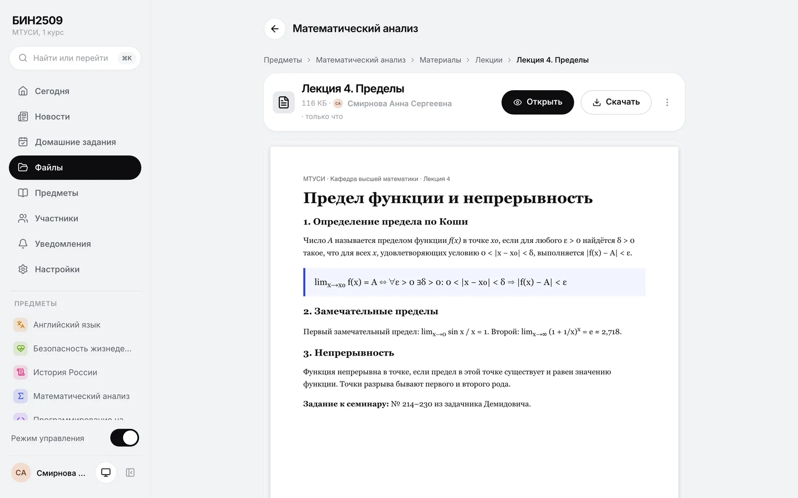</td>
    <td width="50%">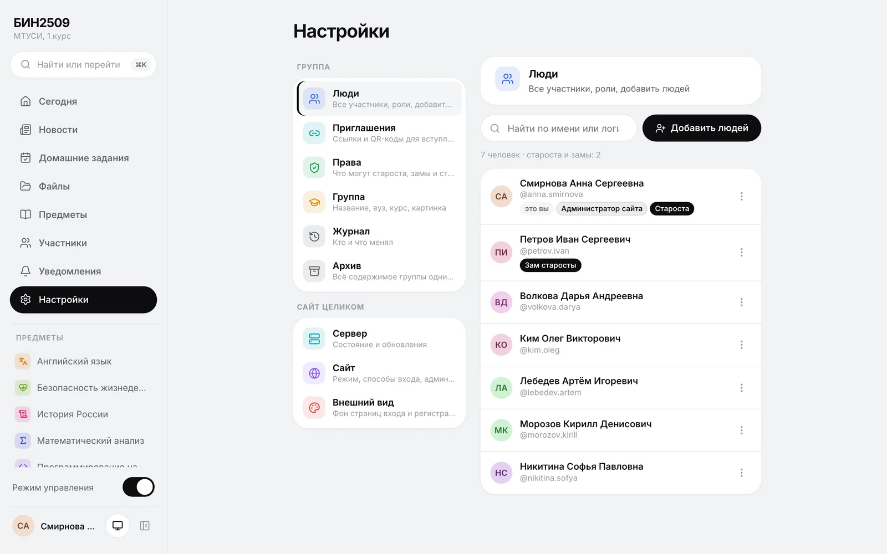</td>
  </tr>
  <tr>
    <td align="center"><b>Материалы</b>: путь до файла и PDF прямо на странице</td>
    <td align="center"><b>Настройки</b>: группа отдельно от сайта, люди с ролями</td>
  </tr>
  <tr>
    <td colspan="2">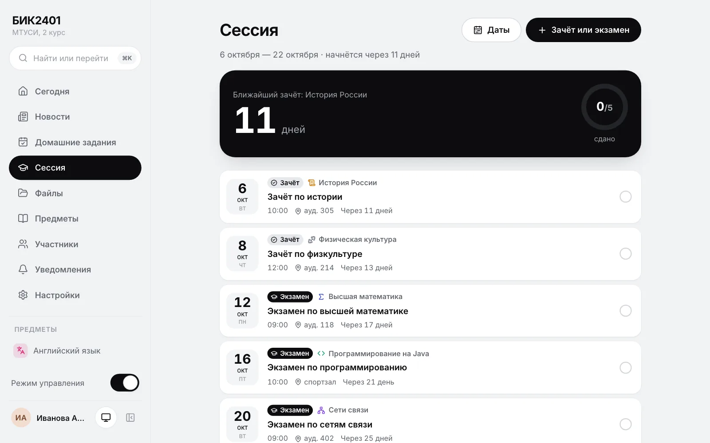</td>
  </tr>
  <tr>
    <td colspan="2" align="center"><b>Сессия</b>: зачёты и экзамены по датам, ближайший — крупно, прогресс «сдано»</td>
  </tr>
</table>

## Возможности

### Задания и новости
- **«Сегодня»**: ближайший дедлайн крупной карточкой, задания по дням, просроченное, срочные и
  закреплённые новости.
- **Домашние задания**: неделя, календарь, просроченное. **Тип** — домашнее, лабораторная,
  контрольная, зачёт или экзамен (с аудиторией), **сложность** — легко, средне, сложно; файлы и
  комментарии. Личная отметка «сделано» видна только вам.
- **Сессия**: зачёты и экзамены по датам, обратный отсчёт до ближайшего, аудитория и прогресс
  «сдано 3 из 7». Староста задаёт даты — за три недели до начала у всех на главной появляется
  карточка с отсчётом. Напоминание придёт накануне: «Скоро экзамен · Физика — завтра в 9:00».
  Кнопка «Сессия» в меню нужна пару раз в год: по умолчанию она видна только около сессии, а
  староста может показывать её всегда или скрыть («Настройки → Семестр»).
- **Новый семестр** в пару минут: закончившиеся предметы — в архив (задания и файлы остаются), новые
  — одним списком «Физика — Иванов И. И.» с иконками по названию, даты следующей сессии.
- **Новости**: срочные выделяются, важные закрепляются, у каждой есть комментарии.
- **Всё появляется само**: новый комментарий, новость или задание видны у всех сразу, без
  перезагрузки страницы; колокольчик тоже обновляется мгновенно.
- **Поиск** понимает русские окончания: «задача» найдёт и «задачи», «расчет» — «расчёт».
  Палитра `Ctrl/⌘ + K` для поиска и быстрых действий.

### Файлы
- **Одно дерево с путём**: «Файлы › Физика › Материалы › Лекции» и «Файлы › Физика › Задания ›
  Лабораторная №3». Путь виден и на странице каждого задания и материала.
- **Открываются прямо в приложении**: PDF (свой просмотрщик, на iPhone тоже все страницы),
  фотографии, видео, аудио и текст. Файлы листаются свайпом, масштаб меняется кнопками. Остальные
  файлы можно скачать.
- **Загрузка**: выбрать, перетащить, вставить скриншот `Ctrl + V` или сфотографировать на телефоне.
  Файлы шифруются на диске.

### Предметы
- Преподаватель, цвет и **иконка**. На выбор 80 иконок по разделам с поиском: Σ, атом, колба, код,
  схема сети, языки, гантель… Если не выбрать, иконка **подберётся по названию** сама.
- **Фон карточки** вместо иконки — любая картинка (фото учебника, аудитории): на плитках и во всю
  шапку предмета.
- Материалы по папкам, свой чат в Telegram, общий предмет для нескольких групп потока.

### Люди и роли
- **Люди** — в «Участниках» и в личном кабинете старосты и администратора: все одногруппники с
  ролями, поиск и меню действий.
- **«Добавить людей»**:
  - по одному: вписал ФИО, и сразу QR-код — человек сканирует его и сам задаёт пароль;
  - списком: у каждого своя ссылка с QR-кодом, лист можно распечатать;
  - одной ссылкой-приглашением — в чат или «на весь экран» для проектора.
- **Роли**: староста, заместитель, студент в группе; **модератор и администратор** — на всём сайте.
  Администратор назначает любые роли, в том числе себе. Последнего администратора снять нельзя.
- **Модерация** — свой раздел у администраторов, модераторов и старост: жалобы участников и
  материалы на проверку, свежие комментарии, скрытое (вернуть или удалить насовсем) и журнал.
  Пожаловаться можно на любую новость, задание, материал или комментарий — модераторы увидят
  пояснение, но не имя.
- **Сброс пароля** за минуту: человек сканирует QR-код, который показывает староста.

### Вход и устройства
- **Как приложение** на iPhone, Android, Windows и macOS — из браузера, без магазинов. Внутри есть
  пошаговый мастер установки.
- **Вход по отпечатку или лицу** (passkeys): Face ID, Touch ID, отпечаток на Android, Windows Hello
  и ключи безопасности (YubiKey и похожие, по USB и NFC). Ключ подсказывается прямо в поле логина,
  как сохранённый пароль.
  Без пароля и кода 2FA — и такой ключ нельзя выманить на поддельном сайте.
- **Вход без ввода**: выбрать свой аккаунт на знакомом устройстве или войти по QR-коду с телефона.
  «Придумать за меня» даст пароль вроде `лиса-маяк-пирог-42`.
- **Второе устройство**: та же ссылка-приглашение предложит просто войти, регистрироваться заново не
  нужно.
- **На телефоне** — те же разделы, что на компьютере: внизу Сегодня, Новости, ДЗ, Предметы и
  Профиль, поиск — вверху. Страница не прыгает от касаний и сразу занимает весь экран; сохранённый
  сайт открывается без ожидания сети, при слабой связи сначала показывается копия с телефона.
- **Оформление под себя** (Профиль → Оформление): светлая, тёмная или как в системе, шесть цветов —
  Классика, Графит, Океан, Лес, Закат, Виноград; восемь стилей карточек — Обычный, Объём, Стекло,
  Цвет предметов, Контур, Неон, Бумага, Комикс; фон страниц — Аврора, Закат, Океан, Мята, Клетка,
  Точки, Линейка или своя картинка; и значок сайта в шести цветах.
- **Знакомство** после регистрации: несколько карточек о том, что где и как пользоваться. Открыть
  снова — «Профиль → Как пользоваться groupbase».

### Без интернета и уведомления
- **Офлайн**: данные группы хранятся на устройстве. Без сети можно читать всё, отмечать выполненное,
  комментировать и публиковать — всё уйдёт на сервер по порядку. Файлы сохраняются заранее: до 20 МБ,
  все или только открытые.
- **Уведомления**: колокольчик и push на телефон и в браузер компьютера — новые задания, новости,
  напоминание за сутки, утренняя сводка. Что присылать, выбирается переключателями; «Проверить»
  присылает пробное и объясняет, если что-то не так.
- **Telegram**: закрепите чат группы — ссылка появится на главной у всех.

### Для хоста и администратора
- **Приложение для Windows и macOS** со значком в трее: сервер группы работает внутри, автозапуск,
  «не давать компьютеру засыпать».
- **Доступ для группы**: CloudPub (рекомендуем, порт 443 — работает с VPN и без), fxTunnel, локальная
  сеть или свой адрес.
- **Резервные копии** раз в сутки — в папку Яндекс Диска, iCloud Drive, OneDrive, Google Диска или
  Dropbox. Восстановление и переезд на новый компьютер в пару кликов.
- **Обновление одной кнопкой**: приложение само находит новую версию, ставит её и перезапускается.
  Обновления подписаны.
- **Внешний вид**: фон страниц входа — встроенный рисунок или своя картинка.
- **Режим управления** прячет кнопки администратора, чтобы пользоваться сайтом как участник.
- Архив группы в ZIP, который открывается без groupbase, журнал действий, права для замов и студентов.
- **Команды обслуживания** — `groupbase doctor` проверит данные, `user reset-2fa` вернёт доступ
  администратору, потерявшему телефон, `backup` и `restore` — копии из терминала (см. «Свой сервер»).

## Быстрый старт

**1. Скачайте установщик** со страницы [последнего выпуска](https://github.com/mitaro-cs/StorageSystem/releases/latest):

| Компьютер | Файл |
|---|---|
| Mac с чипом M1–M4 (Apple Silicon) | `groupbase-…-macos-apple-silicon.dmg` |
| Mac с процессором Intel | `groupbase-…-macos-intel.dmg` |
| Windows 10 и 11 | `groupbase-…-windows-setup.exe` |

**2. Установите.** Программа бесплатная и без платной подписи разработчика, поэтому система один раз
переспросит:
- **macOS 11+**: перетащите groupbase в «Программы». Если macOS не может проверить разработчика:
  «Системные настройки» → «Конфиденциальность и безопасность» → «Всё равно открыть».
- **Windows**: «Windows защитила ваш компьютер» → «Подробнее» → «Выполнить в любом случае». Права
  администратора не нужны.

**3. Первый запуск.** Введите название группы, своё ФИО и пароль (можно «Придумать за меня»). Вы
станете администратором сайта и старостой.

**4. Откройте доступ.** «Настройки» → «Сервер» → «Интернет — CloudPub» → войти (бесплатная
регистрация за минуту) → «Открыть доступ». Появятся постоянная ссылка и QR-код.

**5. Добавьте группу.** «Участники» → «Добавить людей»: вставьте список группы или показывайте QR-код
каждому на паре.

> Подробная инструкция с ответами на вопросы — в [docs/desktop.md](docs/desktop.md).

### Для одногруппников

1. Отсканируйте QR-код или откройте ссылку из чата, впишите ФИО и пароль.
2. На главной нажмите «Установить на телефон»: мастер покажет шаги для iPhone или Android.
3. Включите уведомления в профиле — задания будут приходить сами.

## Частые вопросы

<details>
<summary><b>Что будет, когда компьютер старосты выключен?</b></summary>

Сайт недоступен, но у всех, кто его хоть раз открыл, данные сохранены на устройстве. Вверху
появляется «Сервер группы выключен — показаны сохранённые данные». Можно читать, отмечать сделанное,
писать и публиковать — всё уйдёт на сервер, когда компьютер включится. Чтобы сайт был доступен
чаще, включите в меню значка «Запускать при входе в систему» и «Не давать компьютеру засыпать».
Закрытое окно сайт не выключает.
</details>

<details>
<summary><b>Работает ли с VPN, в Wi-Fi вуза и общежития?</b></summary>

Да, если выбран CloudPub: он ходит через обычный HTTPS (порт 443), который открыт почти везде.
fxTunnel использует порт 4443 — в некоторых сетях и с некоторыми VPN он закрыт.
</details>

<details>
<summary><b>Как войти с ноутбука, если я уже зарегистрирован с телефона?</b></summary>

Откройте ту же ссылку или сайт и нажмите «У меня есть аккаунт». Войдите паролем или по QR-коду:
отсканируйте его телефоном, где вы уже вошли. Второй аккаунт не нужен.
</details>

<details>
<summary><b>Забыл пароль</b></summary>

Попросите старосту: в меню «…» у вашего имени есть «Ссылка для сброса пароля» с QR-кодом. Хост
может сменить свой пароль прямо в окне приложения на своём компьютере — старый пароль там не нужен.
</details>

<details>
<summary><b>Как обновить?</b></summary>

Одной кнопкой. Приложение хоста само проверяет выпуски на GitHub и, когда выходит новая версия, спрашивает
«Обновить сейчас?». Нажали «Обновить» — дальше всё само: скачает, установит и откроется заново, данные
сохранятся. Кнопка есть и в меню значка, и в «Настройки → Версия и обновления» — там же видно, какая
версия стоит, и можно проверить обновления сразу. У участников сайт обновится при следующем открытии. Один раз, с версий 0.1.x на 0.2.0 и новее, установщик нужно скачать
вручную.
</details>

<details>
<summary><b>Сменился логотип, а на iPhone значок старый — почему?</b></summary>

iPhone запоминает значок, когда сайт добавляют на экран «Домой», и потом его не меняет — так
устроены все сайты на iPhone. Сам сайт внутри обновится. Чтобы увидеть новый значок, удалите
groupbase с экрана «Домой» и добавьте заново из Safari («Поделиться» → «На экран „Домой“»); после
этого нужно войти ещё раз и снова включить уведомления. На Android значок обновится сам в течение
нескольких дней.
</details>

<details>
<summary><b>Как переехать на другой компьютер?</b></summary>

«Настройки» → «Сервер» → «Резервные копии» → «Скачать». На новом компьютере установите groupbase и
на экране «Первый запуск» нажмите «Восстановить из резервной копии». Затем снова откройте доступ.
</details>

<details>
<summary><b>Что такое «сайт» (инстанс) и какие бывают роли?</b></summary>

**Сайт** — весь ваш groupbase целиком: одна группа или несколько групп потока, их общие настройки
и администраторы. В технических текстах его называют *инстансом*.

| Роль | Где действует | Что может |
|---|---|---|
| Администратор | весь сайт | всё: группы, роли, сервер, доступ из интернета, копии. Обычно это хост |
| Модератор | все группы | разбирать жалобы в «Модерации», скрывать и удалять лишнее в новостях, заданиях и комментариях; людей не блокирует и не исключает |
| Староста, зам | своя группа | приглашать, публиковать, назначать роли в пределах прав; блокирует и исключает людей только староста |
| Студент | своя группа | читать, отмечать сделанное, комментировать |
</details>

<details>
<summary><b>Есть ли приложение для Android в Google Play или APK?</b></summary>

Не нужно: в Chrome сайт группы ставится как настоящее приложение (WebAPK) — со значком, в списке
приложений, с push-уведомлениями и работой без интернета. «Установить на телефон» на главной
покажет шаги. Отдельная обёртка на WebView была бы хуже: в ней не работают push-уведомления.
</details>

<details>
<summary><b>Как войти по отпечатку или лицу?</b></summary>

Войдите паролем, откройте «Профиль» → «Вход по отпечатку или лицу» → «Добавить ключ» и подтвердите
пароль. Телефон или ноутбук спросит отпечаток, лицо или PIN-код. Ключ безопасности (YubiKey по USB
или NFC) — отметьте «Это ключ безопасности», браузер попросит вставить или приложить его. Теперь на
странице входа ключ подсказывается в поле логина, а ещё есть кнопка «Войти по отпечатку или лицу».
Ключ привязан к адресу сайта, поэтому работает на ссылке группы (CloudPub, fxTunnel, свой домен), а
не по IP-адресу. Если адрес сайта сменится, в профиле у ключа будет пометка — добавьте его заново.
</details>

<details>
<summary><b>Сайт или приложение не открывается</b></summary>

Вместо заставки появится причина и код ошибки вида **GB-102**. Что значит каждый код и что делать —
в таблице [в инструкции для хоста](docs/desktop.md#если-что-то-не-так). Частые случаи: GB-102 и
GB-103 — компьютер старосты выключен (у тех, кто уже заходил, откроются сохранённые данные), GB-105
и GB-106 — помогает кнопка «Сбросить кэш и открыть».
</details>

<details>
<summary><b>Администратор потерял телефон с кодами 2FA</b></summary>

На компьютере с сервером выполните `groupbase user reset-2fa ЛОГИН` (у приложения хоста — с
`--data "<каталог данных>"`, см. [docs/desktop.md](docs/desktop.md)). 2FA выключится, все сеансы
завершатся — войдите паролем и включите её заново. В окне приложения хоста код 2FA и так не нужен.
</details>

<details>
<summary><b>Сколько это стоит?</b></summary>

Нисколько. groupbase — открытая программа (AGPL-3.0), CloudPub и fxTunnel бесплатны. Сервер и данные
— на компьютере хоста.
</details>

## Приватность и безопасность

- **Всё на вашем компьютере или сервере.** Никакой телеметрии и внешних запросов из браузера:
  шрифты, иконки и просмотрщик PDF встроены. CSP `default-src 'self'` без inline-скриптов.
- **Файлы шифруются** на диске (AES-256-GCM, у каждого файла свой ключ), имена на диске — случайные.
- **Пароли** хранятся как Argon2id. Сессия — случайный токен в cookie `HttpOnly`, `SameSite=Strict`, в
  базе только его хеш. От подбора пароля защищает нарастающая блокировка. Для администраторов и
  модераторов — двухфакторная защита с резервными кодами.
- **Права проверяются на сервере**, изоляция групп покрыта тестами. Логины участников видят только
  староста и администратор.
- **Push-уведомления** зашифрованы для устройства (RFC 8291) — службы браузеров их не читают.
- **Картинки** (аватары, фон входа) перекодируются с нуля: геометки и модель телефона из фото не
  сохраняются. IP-адреса в журнале хранятся 30 дней.
- **Туннель** передаёт трафик как обычный провайдер: HTTPS заканчивается на его сервере, а хранятся
  данные только у хоста. Для полной независимости есть свой домен (см. «Свой сервер»).

Каждый может скачать свои данные в ZIP или удалить аккаунт. Об уязвимостях — в [SECURITY.md](SECURITY.md).

## Свой сервер

<details>
<summary>Тот же groupbase на VPS или домашнем мини-ПК — для опытных</summary>

Нужны **JDK 21+** и **Node.js 22+**. Или можно взять `groupbase.jar` со страницы выпуска — тогда
только Java.

```bash
git clone https://github.com/mitaro-cs/StorageSystem.git groupbase
cd groupbase
make build
java -jar target/groupbase.jar serve
```

Сервер напечатает ссылку вида `http://localhost:8080/setup?code=…` — код первичной настройки уже в
ней. Администратору сразу предложат включить двухфакторную защиту.

Для телефонов нужен адрес в интернете и HTTPS. Проще всего поставить перед groupbase
[Caddy](https://caddyserver.com) — он сам получит сертификат:

```caddyfile
group.example.ru {
	reverse_proxy 127.0.0.1:8080
}
```

```bash
GROUPBASE_BASE_URL=https://group.example.ru java -jar target/groupbase.jar serve
```

Все настройки задаются переменными окружения или файлом `groupbase.toml` (`serve --config groupbase.toml`):

| Переменная | По умолчанию | Что это |
|---|---|---|
| `GROUPBASE_DATA_DIR` | `./data` | где хранить базу, файлы и ключи |
| `GROUPBASE_BASE_URL` | — | адрес сайта, например `https://group.example.ru` |
| `GROUPBASE_HTTP_ADDRESS` | `127.0.0.1` | на каком адресе слушать (`0.0.0.0` — все) |
| `GROUPBASE_HTTP_PORT` | `8080` | порт |
| `GROUPBASE_HTTP_INSECURE` | `false` | без HTTPS (только локальная сеть и проверка) |
| `GROUPBASE_TIMEZONE` | `Europe/Moscow` | часовой пояс для сроков и утренней сводки |
| `GROUPBASE_UPLOADS_MAX_FILE_MB` | `50` | лимит размера одного файла |
| `GROUPBASE_AUTH_REQUIRE_STAFF_TOTP` | `true` | обязательная 2FA для администраторов и модераторов |
| `GROUPBASE_PUSH_ENABLED` | `true` | push-уведомления |
| `GROUPBASE_PUSH_SUBJECT` | адрес сайта | контакт для служб push: `mailto:` с настоящим доменом или `https://` |
| `GROUPBASE_BACKUP_AT` | `03:30` | время ежедневной копии |
| `GROUPBASE_BACKUP_KEEP` | `14` | сколько копий хранить |
| `GROUPBASE_BACKUP_DIR` | `data/backups` | каталог копий |
| `GROUPBASE_UPDATE_CHECK` | `true` | спрашивать GitHub о новой версии |

За обратным прокси адрес посетителя и HTTPS берутся из `X-Forwarded-For` и `X-Forwarded-Proto` —
только от прокси на этой же машине. Иначе задайте их адреса в `SERVER_TOMCAT_REMOTEIP_INTERNAL_PROXIES`.

**Команды обслуживания** (у всех есть `--help`, `-c groupbase.toml` и `-d каталог-данных`):

| Команда | Что делает |
|---|---|
| `groupbase init --group БИК2401 --name "Иванова Анна Сергеевна"` | первичная настройка без браузера; пароль спросит (или `--password-stdin`) |
| `groupbase user list` | все аккаунты: логин, имя, роль, 2FA |
| `groupbase user reset-2fa ЛОГИН` | выключить 2FA и завершить сеансы — если потерян телефон и резервные коды |
| `groupbase user reset-password ЛОГИН` | одноразовая ссылка для нового пароля |
| `groupbase backup [-o путь]` | копия в ZIP (база, файлы, ключи); сервер можно не останавливать |
| `groupbase restore КОПИЯ.zip` | восстановить; прежние данные уходят в `before-restore-…`, при работающем сервере — на следующем запуске |
| `groupbase doctor` | проверить без изменений: база, ключи, файлы, место на диске, копии; код 1 — есть проблема |
| `groupbase seed` | демо-группа на пустом сайте (пароль `demo-password`) |
</details>

## Как устроено

| Часть | Технологии |
|---|---|
| Сервер | Java 21, Spring Boot 4 на виртуальных потоках, SQLite (WAL, FTS5), Flyway, явный SQL без ORM |
| Интерфейс | SvelteKit 2 и Svelte 5 (SPA), service worker, IndexedDB, pdf.js — всё собрано внутрь одного `jar` |
| Приложение хоста | Tauri 2 (Rust, системный WebView), встроенная Java (jlink), автообновление с подписью |
| Доступ из интернета | клиенты CloudPub и fxTunnel скачиваются с проверкой SHA-256 и держат туннель сами |

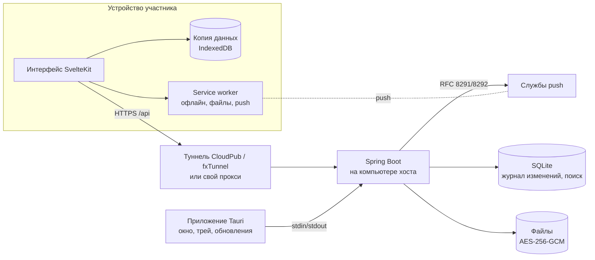

- **Офлайн**: журнал изменений на триггерах SQLite и `/api/sync`. Сервер отдаёт изменения после
  курсора уже с учётом прав, а действия без сети копятся в очереди на устройстве.
- **Когда хост выключен**, туннель отвечает своей страницей. Приложение участника по метке
  `X-Groupbase` понимает, что это не сервер, и показывает сохранённое.
- **Поиск** — SQLite FTS5 с упрощённым стеммингом русских окончаний.

## Разработка

```bash
make dev          # бэкенд на :8080 и vite на :5173 с прокси /api
make test         # JUnit и Vitest (покрытие сервера ≥ 70%)
make lint         # форматирование, javac -Werror, ESLint, Prettier, svelte-check
make e2e          # сценарии Playwright против собранного jar
make desktop      # установщик приложения хоста для этой ОС (нужен Rust)
make desktop-run  # приложение из исходников, данные — в ./data-desktop
```

**Тесты**: у каждого пакета сервера свои тесты — больше 300 юнит- и интеграционных, а
`EveryPackageHasTestsTest` не даст добавить пакет без них. На фронтенде — Vitest, в браузере — 23
сценария Playwright: от первого запуска до входа по отпечатку (виртуальный ключ Chromium) и
проверки, что на телефоне ни одна страница не шире экрана. CI на каждый коммит собирает и
**по-настоящему запускает** приложение на Windows и macOS. Демо-данные для разработки — `make seed`.

**Выпуск**: тег `v1.2.3` → GitHub Actions соберёт `.dmg` для обоих видов Mac, установщик для Windows,
`groupbase.jar` и подписанный `latest.json` для автообновления.

Структура и соглашения — в [CLAUDE.md](CLAUDE.md). Коммиты — [Conventional Commits](https://www.conventionalcommits.org/ru/),
интерфейс и сообщения об ошибках — на русском.

## Планы

- [x] Аккаунты, приглашения, роли и права, 2FA с резервными кодами
- [x] Предметы с иконками, задания со сложностью, новости, материалы с шифрованием
- [x] Поиск, уведомления и push, напоминания, экспорт в ZIP
- [x] Офлайн-режим, приложение с экрана «Домой», вход по QR, вход со второго устройства
- [x] Приложение хоста для Windows и macOS: доступ через CloudPub или fxTunnel, копии, автообновление
- [x] Файлы деревом с путём и просмотром в приложении, свой фон входа
- [x] Типы заданий (лабораторная, контрольная, зачёт, экзамен), режим «Сессия», мастер «Новый семестр»
- [x] Вход по отпечатку или лицу (passkeys)
- [x] Android — через установку из Chrome (WebAPK): значок, push, офлайн; отдельный APK не нужен
- [x] Команды обслуживания `groupbase init / user / backup / restore / doctor / seed`

## Лицензия

[GNU AGPL-3.0](LICENSE): пользоваться, менять и разворачивать можно свободно. Если вы запускаете
изменённую версию для других людей, её исходный код тоже должен быть открыт.
