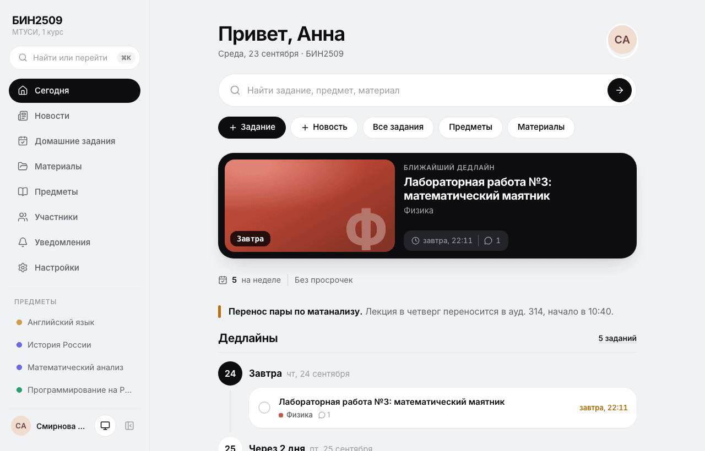
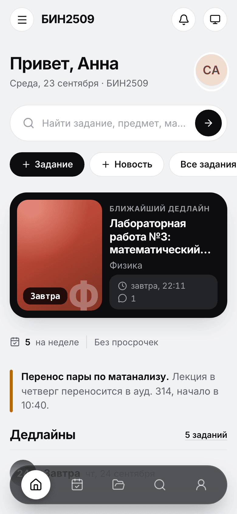
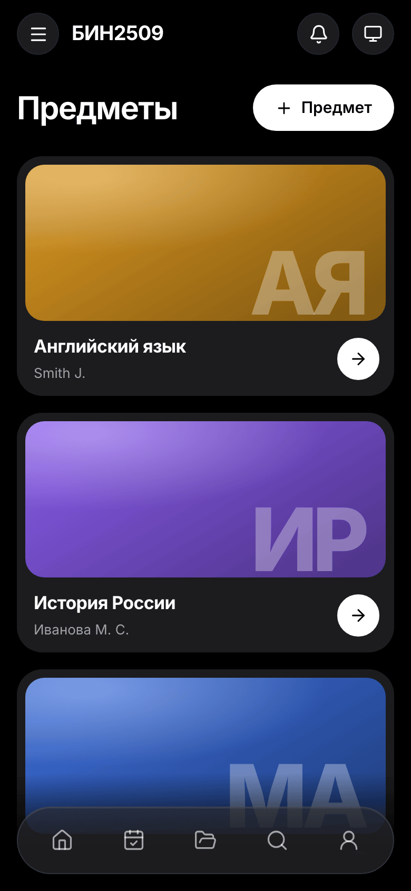
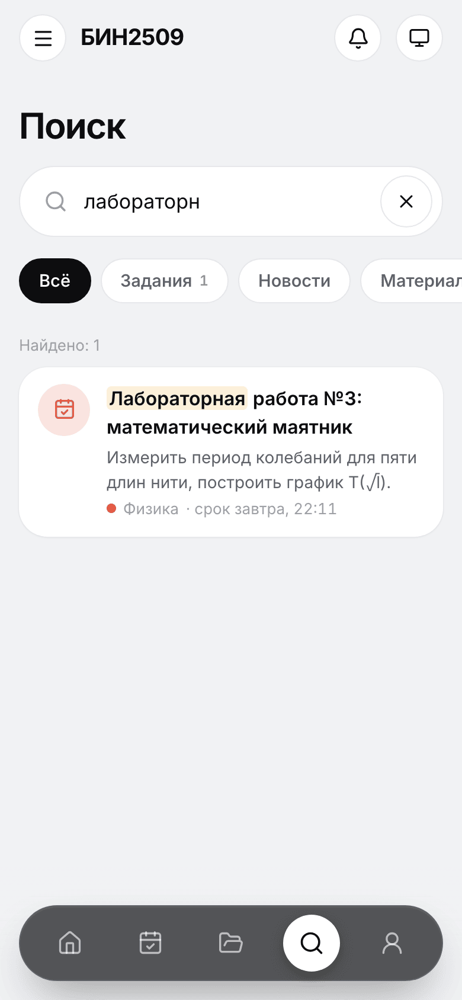
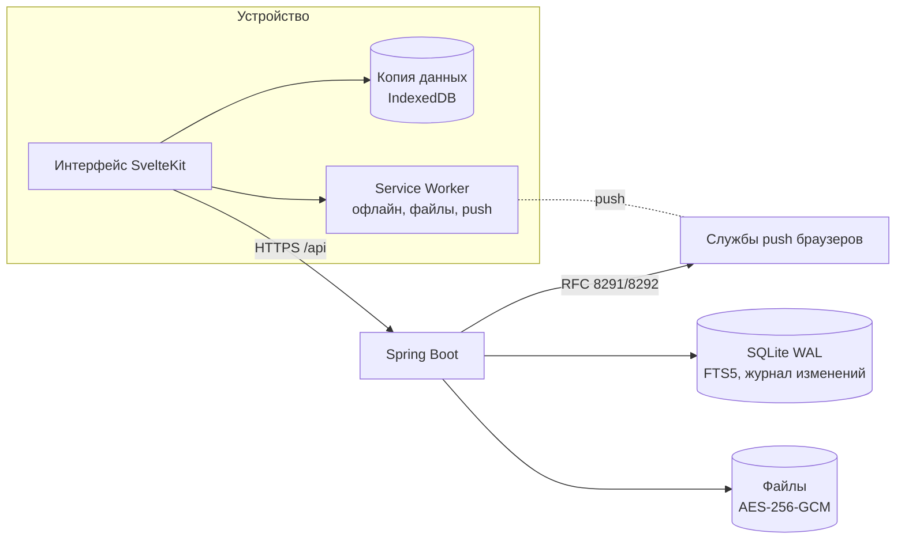

# groupbase

**Сайт и приложение для учебной группы на своём сервере.** Домашние задания, новости и материалы по
предметам в одном месте — с телефона, компьютера и даже без интернета. Данные группы хранятся только
у неё: без рекламы, трекеров, внешних шрифтов и «облаков».

[](https://github.com/mitaro-cs/StorageSystem/actions/workflows/ci.yml)
[](LICENSE)

<p>
  
</p>

<table>
  <tr>
    <td width="33%"></td>
    <td width="33%"></td>
    <td width="33%"></td>
  </tr>
  <tr>
    <td align="center">«Сегодня» на телефоне</td>
    <td align="center">Предметы, тёмная тема</td>
    <td align="center">Поиск по всему</td>
  </tr>
</table>

---

## Зачем

В группе всё обычно разбросано: задания — в чате, методички — в облаке у старосты, перенос пары — в
сообщении, которое утонуло за вечер. groupbase собирает это в одно место, где:

- **сразу видно, что сдать** — главная показывает ближайшие дедлайны по дням и просроченное;
- **ничего не теряется** — материалы разложены по предметам и папкам, поиск понимает русские окончания;
- **работает без интернета** — в метро и в аудитории без сети всё открывается, а сделанное уйдёт на
  сервер, когда связь вернётся;
- **приходит напоминание** — push-уведомление о новом задании и за сутки до срока;
- **данные принадлежат группе** — сервер ставится на компьютер старосты, дешёвый VPS или домашний
  мини-ПК. Один сервер — одна группа или целый поток.

## Возможности

### Для студентов
- **«Сегодня»**: ближайший дедлайн крупной карточкой, задания по дням, срочные новости.
- **Домашние задания**: неделя, календарь, просроченное; личная отметка «сделано» (видна только вам),
  файлы-вложения, комментарии.
- **Материалы** по предметам и папкам: PDF открываются прямо в браузере, ссылки, конспекты.
- **Поиск** по заданиям, новостям, материалам и предметам: «задача» найдёт и «задачи», «расчет» — «расчёт».
- **Уведомления**: колокольчик в приложении и push на телефон — новые задания, новости, напоминание
  за сутки до срока, утренняя сводка. Что присылать, выбирается переключателями.
- **Без интернета**: данные группы хранятся на устройстве. Без сети можно читать всё, отмечать
  выполненное, комментировать и даже публиковать — всё уйдёт на сервер по порядку, когда появится сеть.
  Файлы материалов сохраняются заранее (до 20 МБ, все или только открытые — на выбор).
- **Как приложение**: ставится на экран «Домой» iPhone и Android, на Windows и macOS — из браузера,
  без магазинов. Пошаговый мастер установки внутри.
- **Вход без ввода**: выбрать свой аккаунт на знакомом устройстве или войти по QR-коду с телефона,
  как в мессенджерах. Пароль можно не придумывать — «Придумать за меня» даст фразу вроде
  `лиса-маяк-пирог-42`.
- **Удобства**: светлая и тёмная тема, палитра команд `Ctrl/⌘+K`, горячие клавиши, свайп «назад»,
  выгрузка всех своих данных в ZIP.

### Для старост
- **Предметы** с преподавателем, цветом и обложкой; общий предмет для нескольких групп потока.
- **Публикация** заданий с файлами и новостей (срочные, закреплённые) в пару касаний.
- **Приглашения**: ссылка в чат или **QR-код на весь экран** для проектора — одногруппники сканируют и
  регистрируются, логин подставляется из ФИО. Или создать аккаунты списком и распечатать лист доступа.
- **Сброс пароля** за минуту: QR-код, который человек сканирует своим телефоном.
- **Права**: заместителю можно разрешить создавать аккаунты и предметы, студентам — предлагать
  материалы на проверку.
- **Модерация**, журнал действий, **архив группы в ZIP**, который открывается без groupbase
  (участники — в Excel, новости и задания — текстом, материалы — по папкам).
- Чек-лист **«Первые шаги»** на главной: предметы → приглашение → первое задание → приложение →
  уведомления.

### Для администратора
- Одна группа или несколько (поток, кафедра) на одном сервере.
- Обязательная двухфакторная защита для администраторов и модераторов, резервные коды.
- Логины участников видят только староста и администратор.

## Приватность и безопасность

- **Всё на вашем сервере.** Никакой телеметрии и внешних запросов из браузера: шрифты и иконки
  встроены, CSP `default-src 'self'` без inline-скриптов.
- **Файлы шифруются** на диске (AES-256-GCM, у каждого файла свой ключ), имена на диске — случайные UUID.
- **Пароли** — Argon2id; сессии — случайный токен в cookie `HttpOnly`, `Secure`, `SameSite=Strict`,
  в базе только его хеш; защита от подбора с нарастающей блокировкой.
- **Права проверяются на сервере**, изоляция групп покрыта тестами; поиск, уведомления и
  синхронизация показывают только то, что пользователю разрешено.
- **Push-уведомления** зашифрованы для устройства (RFC 8291) — службы браузеров их не видят;
  сервер отправляет только на домены служб push.
- IP-адреса в журнале хранятся 30 дней; каждый может скачать свои данные или удалить аккаунт.

Как сообщить об уязвимости — в [SECURITY.md](SECURITY.md).

## Быстрый старт

> Готовые сборки для Windows, macOS и Linux и установка одной командой — в работе (см. [Планы](#планы)).
> Пока groupbase запускается из исходников — это пара команд.

Нужны **JDK 21+** и **Node.js 22+**.

```bash
git clone https://github.com/mitaro-cs/StorageSystem.git groupbase
cd groupbase
make build
java -jar target/groupbase.jar serve
```

Сервер напечатает ссылку вида `http://localhost:8080/setup?code=…` — откройте её: код первичной
настройки уже в ней. Дальше мастер попросит название группы, ваше ФИО и пароль; вы станете
администратором сайта и старостой группы. Администратору сразу предложат включить двухфакторную
защиту — понадобится приложение-аутентификатор (Яндекс Ключ, Google Authenticator, Aegis) — и
сохранить резервные коды.

Данные хранятся в каталоге `./data` (база SQLite, зашифрованные файлы и ключи в `data/secrets`).
**Бэкап — это копия каталога `data` целиком**, вместе с ключами.

### Чтобы зашли одногруппники

Для входа с телефонов сайту нужен адрес в интернете и HTTPS (без него браузеры не дают ставить
приложение, присылать уведомления и открывать камеру для QR). Проще всего поставить перед groupbase
[Caddy](https://caddyserver.com) — он сам получит сертификат:

```caddyfile
group.example.ru {
	reverse_proxy 127.0.0.1:8080
}
```

и запустить groupbase с адресом сайта:

```bash
GROUPBASE_BASE_URL=https://group.example.ru java -jar target/groupbase.jar serve
```

### Настройки

Всё задаётся переменными окружения или файлом `groupbase.toml` (`serve --config groupbase.toml`).

| Переменная | По умолчанию | Что это |
|---|---|---|
| `GROUPBASE_DATA_DIR` | `./data` | где хранить базу, файлы и ключи |
| `GROUPBASE_BASE_URL` | — | адрес сайта, например `https://group.example.ru` |
| `GROUPBASE_HTTP_ADDRESS` | `127.0.0.1` | на каком адресе слушать (`0.0.0.0` — все) |
| `GROUPBASE_HTTP_PORT` | `8080` | порт |
| `GROUPBASE_HTTP_INSECURE` | `false` | работа без HTTPS (только для локальной сети и проверки) |
| `GROUPBASE_TIMEZONE` | `Europe/Moscow` | часовой пояс для сроков и утренней сводки |
| `GROUPBASE_UPLOADS_MAX_FILE_MB` | `50` | лимит размера одного файла |
| `GROUPBASE_AUTH_REQUIRE_STAFF_TOTP` | `true` | обязательная 2FA для администраторов и модераторов |
| `GROUPBASE_PUSH_ENABLED` | `true` | push-уведомления |
| `GROUPBASE_PUSH_SUBJECT` | адрес сайта | контакт администратора для служб push (`mailto:` или `https://`) |
| `GROUPBASE_APP_KEY`, `GROUPBASE_FILES_KEY`, `GROUPBASE_VAPID_KEY` | создаются в `data/secrets` | ключи, если хранить их вне каталога данных |

## Как пользоваться

**Староста, первый день:**
1. Откройте ссылку из окна сервера и пройдите «Первый запуск».
2. «Предметы» → «+ Предмет» для каждого предмета семестра.
3. «Настройки» → «Приглашения» → «Создать ссылку» → «QR на весь экран» — покажите на паре.
4. Опубликуйте первое задание: «+ Задание» на главной.

**Студент:**
1. Отсканируйте QR-код или откройте ссылку из чата, впишите ФИО и пароль (или «Придумать за меня»).
2. Установите приложение: на главной есть чек-лист и мастер «Установить на телефон».
3. Включите уведомления в профиле — и всё, задания будут приходить сами.

**Забыли пароль?** Попросите старосту: он покажет QR-код для сброса.

## Как это устроено



- **Сервер** — Java 21 + Spring Boot 4 (виртуальные потоки), SQLite в режиме WAL, миграции Flyway,
  явный SQL без ORM. Интерфейс собирается внутрь одного `jar`.
- **Интерфейс** — SvelteKit 2 + Svelte 5 (SPA), ≈100 КБ JS на страницу, без внешних зависимостей
  во время работы.
- **Офлайн** — журнал изменений на триггерах SQLite и `/api/sync`: сервер отдаёт изменения после
  курсора уже с учётом прав; действия без сети копятся в очереди на устройстве.
- **Поиск** — SQLite FTS5 с упрощённым стеммингом русских окончаний.
- **Push** — собственная реализация шифрования Web Push и подписи VAPID, проверенная на примере из RFC.

## Разработка

```bash
make dev    # бэкенд на :8080 и vite на :5173 с прокси /api
make test   # тесты бэкенда (JUnit, покрытие ≥ 70%) и фронтенда (Vitest)
make lint   # форматирование, javac -Werror, ESLint, Prettier, svelte-check
make e2e    # сквозные сценарии Playwright против собранного jar
```

Структура и соглашения — в [CLAUDE.md](CLAUDE.md). Коммиты — [Conventional Commits](https://www.conventionalcommits.org/ru/),
интерфейс и сообщения об ошибках — на русском.

## Планы

- [x] Аккаунты, приглашения, роли и права, 2FA с резервными кодами
- [x] Предметы, задания, новости, материалы с шифрованием файлов
- [x] Поиск, уведомления и push, напоминания, экспорт в ZIP
- [x] Офлайн-режим с синхронизацией, приложение с экрана «Домой», вход по QR
- [ ] Установка одной командой: HTTPS, автобэкапы, `groupbase init / deploy / backup / restore / doctor`
- [ ] Приложения для Windows, macOS и Android (iPhone уже работает как приложение с экрана «Домой»)
- [ ] Вход по отпечатку или лицу (passkeys), своя обложка страницы входа
- [ ] Типы заданий (контрольная, зачёт, экзамен) и режим «Сессия», мастер «Новый семестр»
- [ ] Подробная документация в `docs/`

## Лицензия

[GNU AGPL-3.0](LICENSE): пользоваться, менять и разворачивать можно свободно; если вы запускаете
изменённую версию для других людей, её исходный код тоже должен быть открыт.
