<p align="center">
  <picture>
    <source media="(prefers-color-scheme: dark)" srcset="docs/banner-dark.svg">
    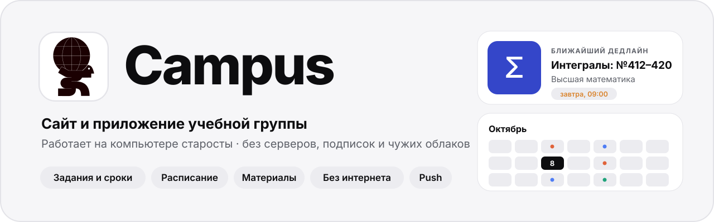
  </picture>
</p>

<p align="center">
  <a href="https://github.com/mitaro-cs/StorageSystem/releases/latest"></a>
  <a href="https://github.com/mitaro-cs/StorageSystem/actions/workflows/ci.yml"></a>
  
  
  <a href="LICENSE"></a>
</p>

<p align="center">
  <a href="https://github.com/mitaro-cs/StorageSystem/releases/latest"><b>Скачать</b></a> ·
  <a href="#быстрый-старт">Быстрый старт</a> ·
  <a href="docs/desktop.md">Инструкция для хоста</a> ·
  <a href="#частые-вопросы">Вопросы</a> ·
  <a href="CHANGELOG.md">Что нового</a>
</p>

<p align="center">
  <picture>
    <source media="(prefers-color-scheme: dark)" srcset="docs/screenshots/desktop-today-dark.webp">
    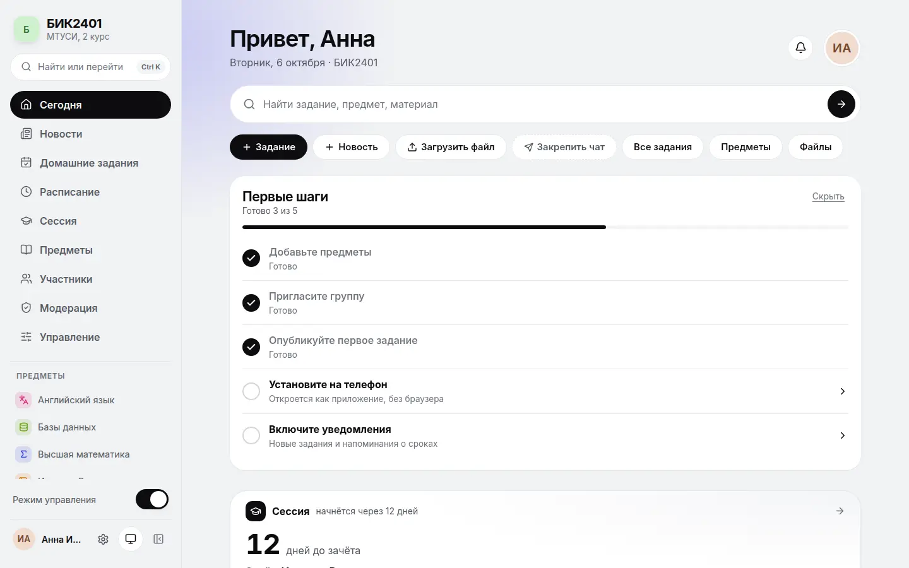
  </picture>
</p>

<br>

<table>
  <tr>
    <td width="33%" valign="top">
      <h3>Студенту</h3>
      <sub>что сдать и когда – с первого взгляда</sub>
      <ul>
        <li>задания по дням, отметка «сделано»</li>
        <li>расписание: день, неделя, месяц</li>
        <li>лекции и конспекты – прямо в приложении</li>
        <li>всё работает без интернета</li>
        <li>push о новом задании и за сутки до срока</li>
      </ul>
    </td>
    <td width="33%" valign="top">
      <h3>Старосте</h3>
      <sub>задание или новость – в пару касаний</sub>
      <ul>
        <li>расписание из файла календаря (.ics)</li>
        <li>человек в группе – ФИО и QR-код</li>
        <li>предметы с иконками и фоном</li>
        <li>роли, права, модерация</li>
        <li>сессия и «Новый семестр»</li>
      </ul>
    </td>
    <td width="33%" valign="top">
      <h3>Хосту</h3>
      <sub>сайт живёт на вашем компьютере</sub>
      <ul>
        <li>установил – «Открыть доступ»</li>
        <li>бесплатная ссылка, с VPN и без</li>
        <li>второй компьютер – один ключ</li>
        <li>копии в своё облако</li>
        <li>обновление одной кнопкой</li>
      </ul>
    </td>
  </tr>
</table>

## Как это работает

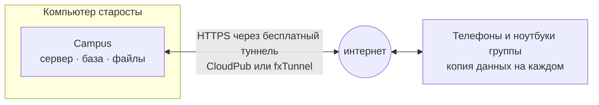
```mermaid
flowchart LR
  subgraph HOST["Компьютер старосты"]
    APP["Campus<br/>сервер · база · файлы"]
  end
  APP <-->|"HTTPS через бесплатный туннель<br/>CloudPub или fxTunnel"| NET(("интернет"))
  NET <--> PH["Телефоны и ноутбуки группы<br/>копия данных на каждом"]
```

1. **Хост** (обычно староста) ставит Campus на Windows или Mac – внутри сразу работает сервер группы.
2. **«Открыть доступ»** – и у сайта постоянная ссылка `https://….cloudpub.ru`. Ни домена, ни
   сервера, ни денег.
3. **Одногруппники** открывают ссылку или QR-код, входят и ставят сайт на экран «Домой» как
   приложение.
4. **Компьютер выключен?** У всех остаётся сохранённое: читать, отмечать и даже публиковать можно –
   всё отправится, когда сервер снова включится.

## Как выглядит

<table>
  <tr>
    <td width="50%">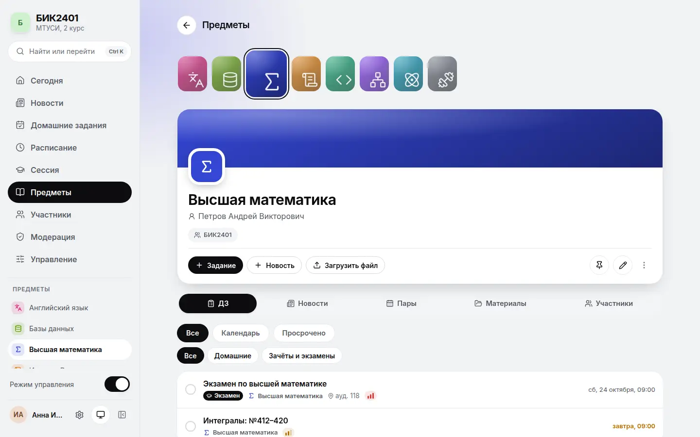</td>
    <td width="50%">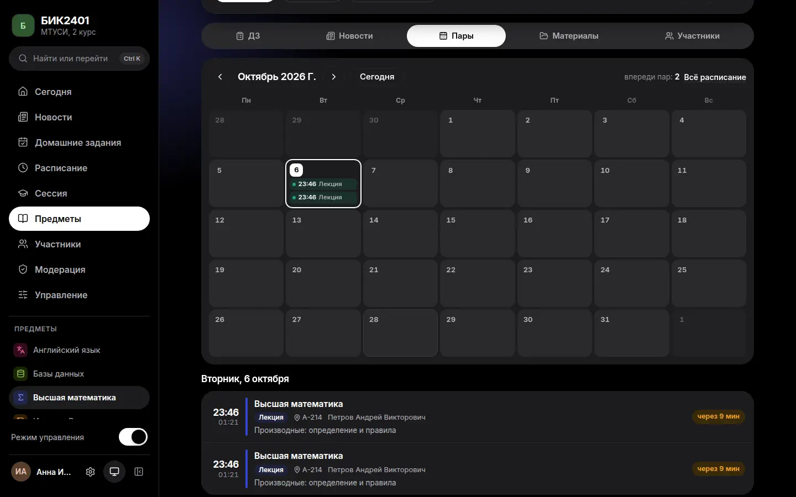</td>
  </tr>
  <tr>
    <td align="center"><b>Предмет</b><br><sub>фон, значок, все действия – в одной карточке</sub></td>
    <td align="center"><b>Пары предмета</b><br><sub>календарь месяца, ниже – пары выбранного дня</sub></td>
  </tr>
  <tr>
    <td>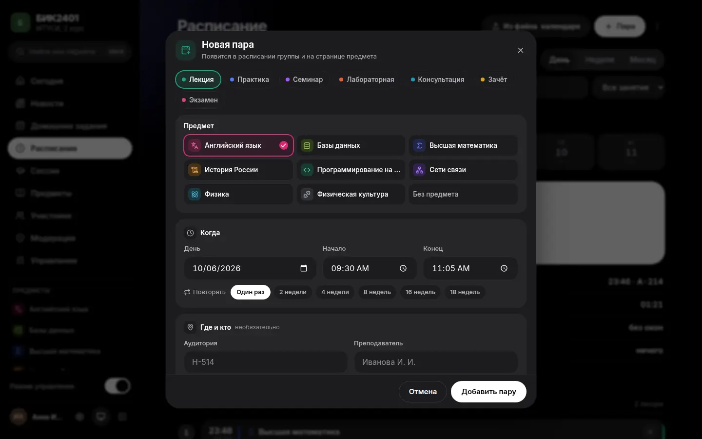</td>
    <td>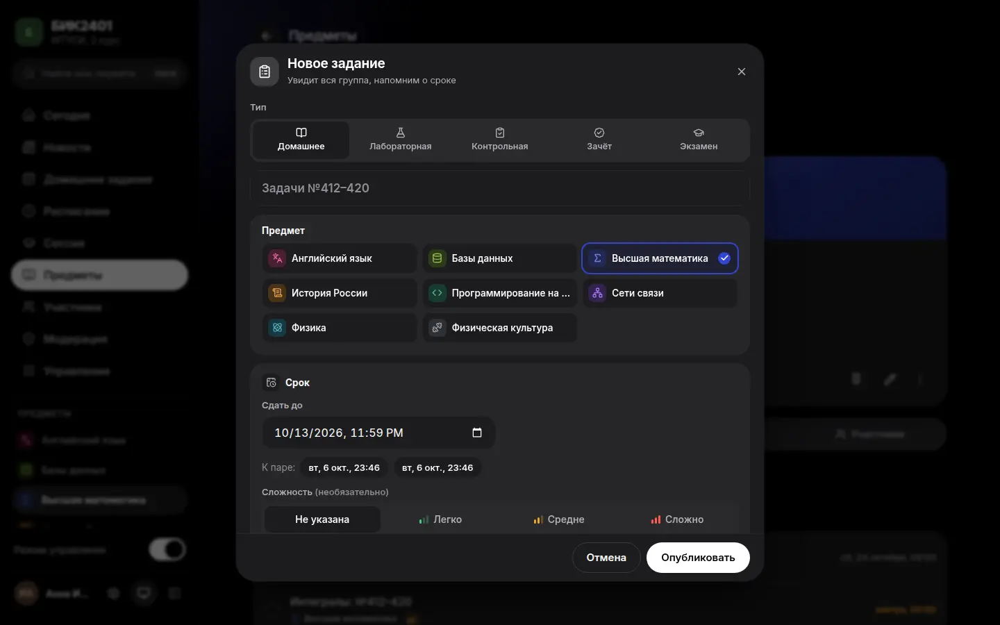</td>
  </tr>
  <tr>
    <td align="center"><b>Новая пара</b><br><sub>вид, предмет плитками, время пар группы одним нажатием</sub></td>
    <td align="center"><b>Новое задание</b><br><sub>тип, срок «к паре», сложность, файлы</sub></td>
  </tr>
  <tr>
    <td>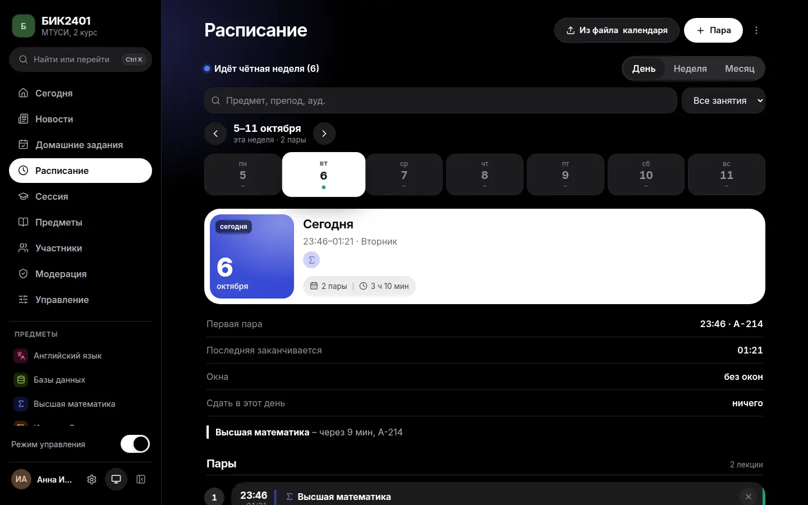</td>
    <td>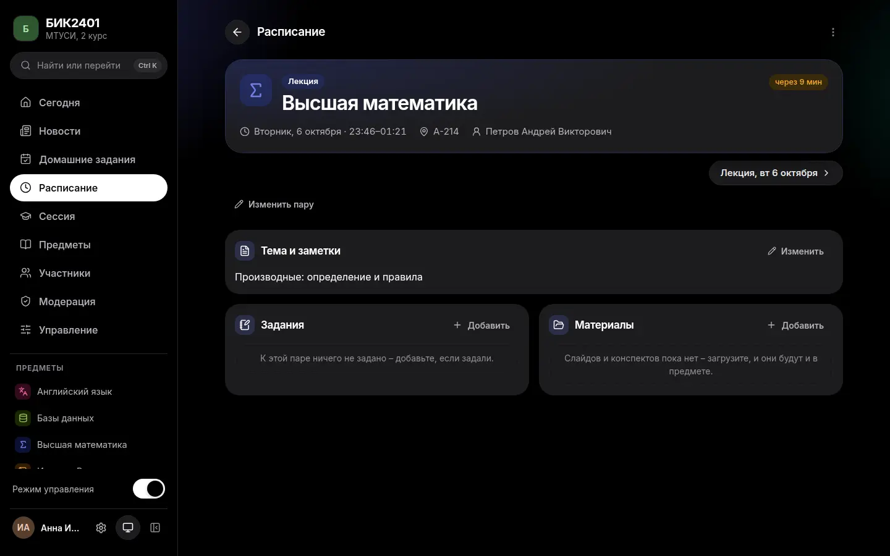</td>
  </tr>
  <tr>
    <td align="center"><b>Расписание</b><br><sub>чётность недели, день, неделя, месяц, поиск</sub></td>
    <td align="center"><b>Пара</b><br><sub>тема, задания и материалы к ней</sub></td>
  </tr>
</table>

<table>
  <tr>
    <td width="20%"><picture><source media="(prefers-color-scheme: dark)" srcset="docs/screenshots/mobile-today-dark.webp">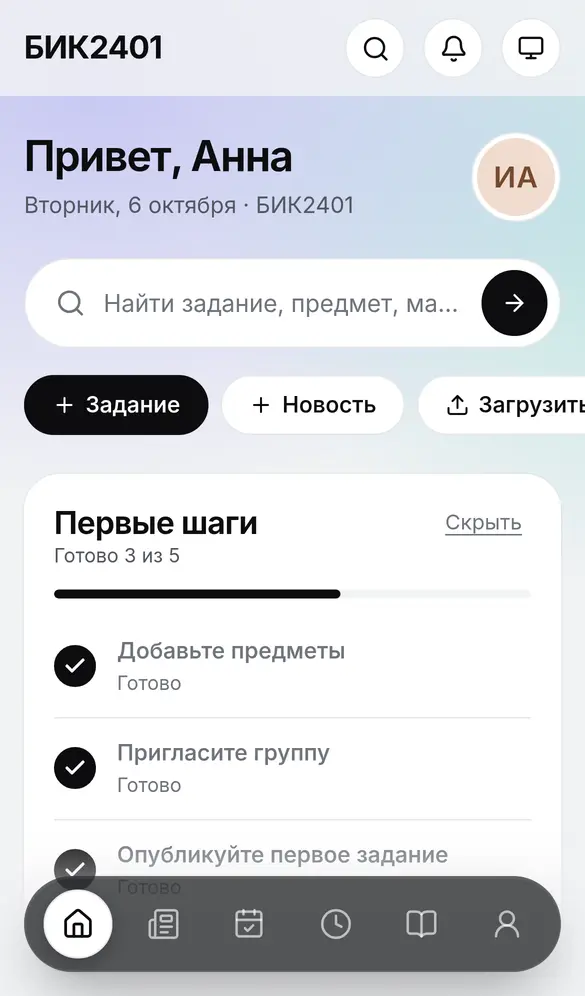</picture></td>
    <td width="20%">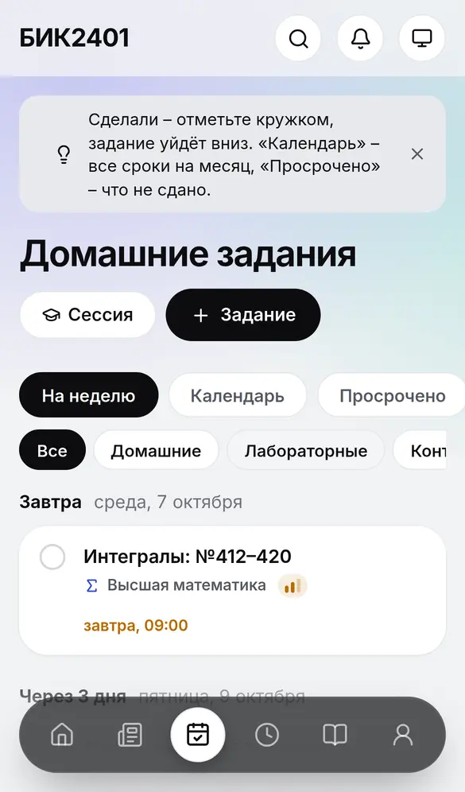</td>
    <td width="20%">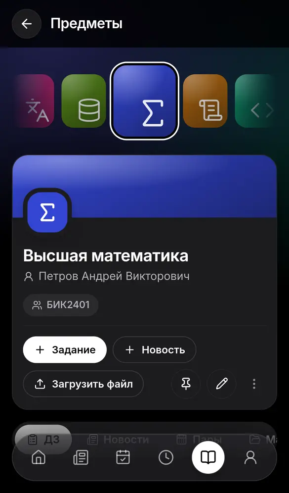</td>
    <td width="20%">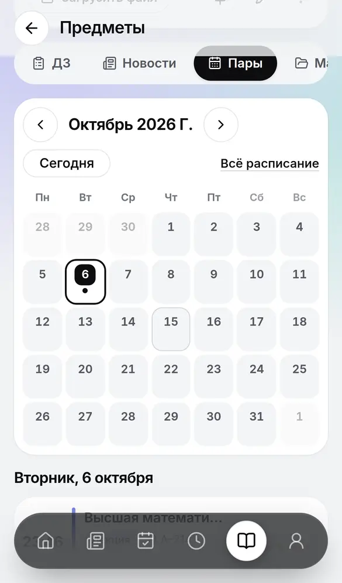</td>
    <td width="20%">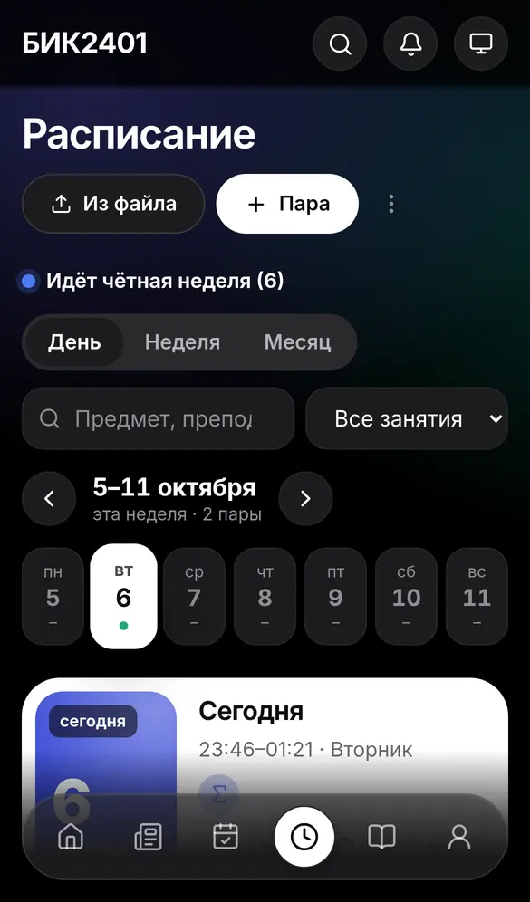</td>
  </tr>
  <tr>
    <td align="center"><sub><b>Сегодня</b></sub></td>
    <td align="center"><sub><b>Задания</b></sub></td>
    <td align="center"><sub><b>Предмет</b></sub></td>
    <td align="center"><sub><b>Пары</b></sub></td>
    <td align="center"><sub><b>Расписание</b></sub></td>
  </tr>
  <tr>
    <td>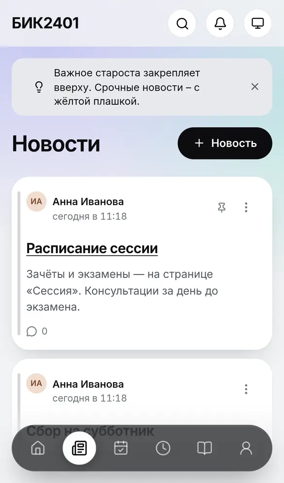</td>
    <td>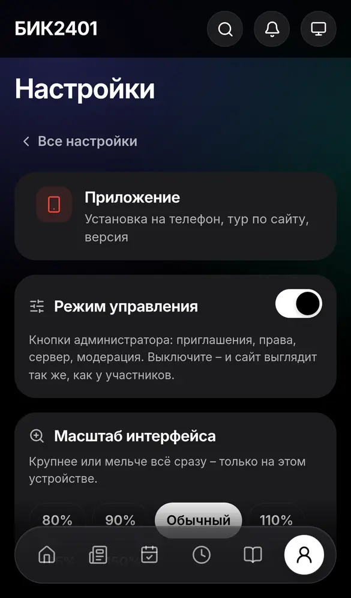</td>
    <td>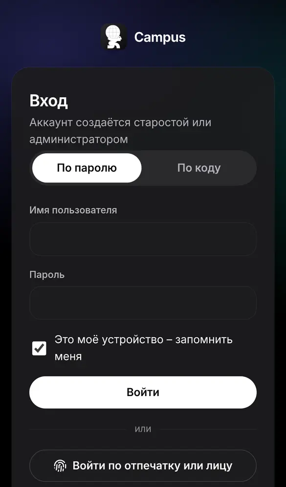</td>
    <td colspan="2">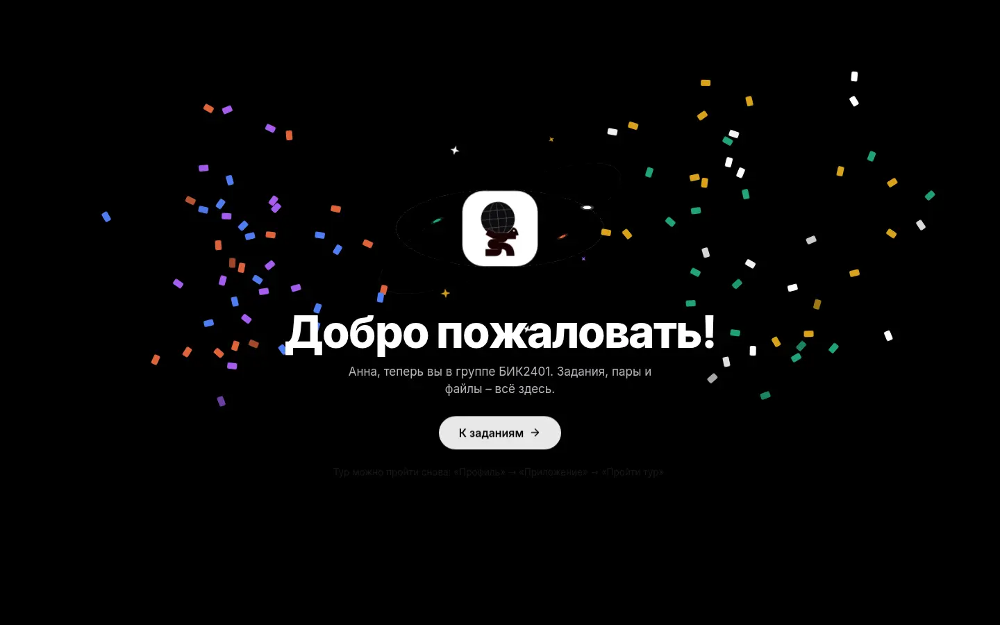</td>
  </tr>
  <tr>
    <td align="center"><sub><b>Новости</b></sub></td>
    <td align="center"><sub><b>Настройки</b></sub></td>
    <td align="center"><sub><b>Вход</b></sub></td>
    <td colspan="2" align="center"><sub><b>Знакомство</b> – тур по живому интерфейсу</sub></td>
  </tr>
</table>

## Возможности

<details open>
<summary><b>Задания и новости</b></summary>

- **«Сегодня»** – ближайший дедлайн крупно, задания по дням, просроченное, срочные и закреплённые
  новости.
- **Задания пяти типов**: домашнее, лабораторная, контрольная (с «откроется / закроется»), зачёт и
  экзамен (с аудиторией). Сложность, файлы, комментарии; отметка «сделано» – только ваша.
- **Сессия** – зачёты и экзамены по датам, отсчёт до ближайшего, «сдано 3 из 7», напоминание
  накануне. **Новый семестр** – старое в архив, новое одним списком.
- **Новости** – срочные и закреплённые, с фото и файлами (большие фото уменьшаются сами).
- **Подгруппы** – английский №1 и №2: «Не мой предмет» убирает чужое из списков и уведомлений.
- **Живые обновления** – новое видно у всех сразу, без перезагрузки.
- **Поиск** понимает русские окончания; палитра `Ctrl K` (`⌘K` на Mac) работает и в русской
  раскладке.
</details>

<details open>
<summary><b>Расписание и пары</b></summary>

- **Из файла календаря (.ics)** – сайт вуза, Google, Яндекс, Apple, Outlook: повторы, переносы и
  отмены как в файле, названия сами сопоставляются с предметами. Повторная загрузка обновляет, а не
  дублирует.
- **День, неделя, месяц**, чётность недели, поиск и фильтр по виду пары.
- **Пара вручную** – вид, предмет плитками, время пар группы одним нажатием, повтор на несколько
  недель.
- **Страница пары** – тема, задания и материалы к ней отдельными карточками.
- **У предмета** – вкладка «Пары» календарём месяца.
</details>

<details open>
<summary><b>Материалы</b></summary>

- **Открываются прямо в приложении**: PDF (свой просмотрщик), фото, видео, аудио, текст.
- **Конспекты в Markdown** (`.md`) – читаются страницей и скачиваются **в Word** одной кнопкой.
- **По типам**: конспекты, PDF, документы, презентации, таблицы… – фильтр в одно касание.
- Папки, ссылки, текстовые сообщения, закрепление. Загрузка – выбрать, перетащить, `Ctrl V` или
  фото с телефона. Файлы шифруются на диске.
</details>

<details>
<summary><b>Люди, роли и вход</b></summary>

- **Добавить людей**: ФИО – и QR-код; списком с листом для печати; одной ссылкой-приглашением.
- **Роли**: староста, заместитель, студент; на всём сайте – модератор и администратор.
- **Модерация**: жалобы, материалы на проверку, скрытое, журнал.
- **Вход**: по отпечатку или лицу (passkeys, ключи безопасности), по коду с другого устройства,
  выбором аккаунта на знакомом устройстве. Вход помнится год.
- **Правила сайта** – с согласием при регистрации.
</details>

<details>
<summary><b>Оформление</b></summary>

- Светлая, тёмная или как в системе; пять дизайнов – Классика, Стекло, Объём, Сияние, Бумага;
  основной цвет и насыщенность – ползунками.
- **Фон** – как на странице входа или своя картинка: приглушить и **размыть на сколько хочется**;
  текст лежит на матовом листе и всегда читается.
- **Масштаб интерфейса** 80–150 % – у каждого свой. Большие мониторы – шире колонки и крупнее текст.
- Значок приложения в нескольких цветах.
</details>

<details>
<summary><b>Без интернета и уведомления</b></summary>

- **Офлайн**: данные группы хранятся на устройстве – читать, отмечать, комментировать и публиковать
  можно без сети. Файлы сохраняются заранее.
- **Уведомления**: колокольчик и push – новые задания и новости, напоминание за сутки, утренняя
  сводка. «Проверить» объясняет, если что-то не так.
- **Файлы с телефонов**: если файла нет на сервере, его досылает устройство, где он сохранён.
</details>

<details>
<summary><b>Для хоста</b></summary>

- **Приложение для Windows и macOS** со значком в трее: автозапуск, «не давать засыпать».
- **Доступ для группы**: CloudPub (порт 443 – работает с VPN), fxTunnel, локальная сеть, свой адрес.
- **Два компьютера – один ключ.** ПК основной, ноутбук – когда ПК выключен: на втором компьютере
  один раз вставляете **ключ сайта**, и он связан навсегда. Основной выбирается в «Управлении»,
  изменения со второго уходят на основной, ничего переносить не нужно.
- **Резервные копии** раз в сутки – в Яндекс Диск, iCloud, OneDrive, Google Диск или Dropbox.
- **Переезд по коду** на новый компьютер – с тем же адресом.
- **Обновление одной кнопкой**, подписанные выпуски.
</details>

## Быстрый старт

**1. Скачайте** со страницы [последнего выпуска](https://github.com/mitaro-cs/StorageSystem/releases/latest):

| Компьютер | Файл |
|---|---|
| Mac с чипом M1–M4 | `groupbase-…-macos-apple-silicon.dmg` |
| Mac с процессором Intel | `groupbase-…-macos-intel.dmg` |
| Windows 10 и 11 | `groupbase-…-windows-setup.exe` |

**2. Установите.** Подписи разработчика нет, поэтому система один раз переспросит:
- **macOS**: перетащите в «Программы»; если macOS не может проверить разработчика – «Системные
  настройки» → «Конфиденциальность и безопасность» → «Всё равно открыть».
- **Windows**: «Windows защитила ваш компьютер» → «Подробнее» → «Выполнить в любом случае».

**3. Первый запуск** – название группы, ваши фамилия, имя, отчество и пароль. Вы станете
администратором и старостой.

**4. Откройте доступ** – «Управление» → «Сервер» → CloudPub → «Открыть доступ». Появятся ссылка и
QR-код.

**5. Добавьте группу** – «Участники» → «Добавить людей».

> Подробно, с ответами на вопросы – в [инструкции для хоста](docs/desktop.md).

**Одногруппникам**: отсканировать QR-код или открыть ссылку → ФИО и пароль → «Установить на телефон»
на главной → включить уведомления в профиле.

## Частые вопросы

<details>
<summary><b>Что будет, когда компьютер хоста выключен?</b></summary>

Сайт недоступен, но у всех, кто его открывал, данные сохранены на устройстве – вверху плашка
«Сервер не работает». Можно читать, отмечать сделанное и публиковать – всё уйдёт на сервер, когда
компьютер включится. Чтобы сайт был доступен чаще, включите «Запускать при входе в систему» и «Не
давать компьютеру засыпать». А если есть второй компьютер – подключите его ключом сайта.
</details>

<details>
<summary><b>Как подключить второй компьютер?</b></summary>

На основном: «Управление» → «Сервер» → «Два компьютера» → «Ключ сайта» → скопировать. На втором:
установить Campus и вставить ключ – при первом запуске или там же, в «Двух компьютерах». Один раз и
навсегда. Какой компьютер основной, выбирается кнопкой «Сделать основным».
</details>

<details>
<summary><b>Работает ли с VPN, в Wi-Fi вуза и общежития?</b></summary>

Да, с CloudPub: он ходит через обычный HTTPS (порт 443). fxTunnel использует порт 4443 – в некоторых
сетях он закрыт.
</details>

<details>
<summary><b>Как войти с ноутбука, если я зарегистрирован с телефона?</b></summary>

Откройте сайт и нажмите «По коду»: на телефоне «Профиль» → «Вход и безопасность» → «Показать код».
Второй аккаунт не нужен.
</details>

<details>
<summary><b>Забыл пароль</b></summary>

Попросите старосту: в меню «…» у вашего имени есть «Ссылка для сброса пароля» с QR-кодом.
</details>

<details>
<summary><b>Как обновить?</b></summary>

Приложение хоста само находит новую версию и спрашивает «Обновить сейчас?» – дальше всё само, данные
сохранятся. У участников сайт обновится при следующем открытии.
</details>

<details>
<summary><b>Какие бывают роли?</b></summary>

| Роль | Где | Что может |
|---|---|---|
| Администратор | весь сайт | всё: группы, роли, сервер, доступ, копии. Обычно это хост |
| Модератор | все группы | жалобы, скрыть и удалить лишнее, публиковать, вести расписание; людей не блокирует |
| Староста, зам | своя группа | приглашать, публиковать, вести расписание; исключает и блокирует только староста |
| Студент | своя группа | читать, отмечать, комментировать, добавлять задания и материалы |
</details>

<details>
<summary><b>Есть ли приложение в Google Play?</b></summary>

Не нужно: в Chrome сайт ставится как настоящее приложение – со значком, push и офлайном. На iPhone –
через Safari «На экран „Домой“». «Установить на телефон» на главной покажет шаги.
</details>

<details>
<summary><b>Сайт или приложение не открывается</b></summary>

Появится причина и код вида **GB-102** – что он значит, в [инструкции для хоста](docs/desktop.md#если-что-то-не-так).
</details>

<details>
<summary><b>Сколько это стоит?</b></summary>

Нисколько. Campus – открытая программа (AGPL-3.0), CloudPub и fxTunnel бесплатны.
</details>

## Приватность и безопасность

- **Всё у вас.** Никакой телеметрии и внешних запросов: шрифты, иконки и просмотрщик PDF встроены,
  CSP `default-src 'self'`.
- **Файлы шифруются** (AES-256-GCM, свой ключ у каждого), имена на диске случайные.
- **Пароли** – Argon2id, сессия – токен в cookie `HttpOnly`, `SameSite=Strict`, в базе только хеш.
  Подбор пароля блокируется, администраторам – обязательная 2FA.
- **Права проверяются на сервере**, изоляция групп покрыта тестами.
- **Push** зашифрован для устройства (RFC 8291), **фото** перекодируются без геометок.

Каждый может скачать свои данные или удалить аккаунт. Об уязвимостях – в [SECURITY.md](SECURITY.md).

## Свой сервер

<details>
<summary>Campus на VPS или домашнем мини-ПК – для опытных</summary>

Нужны **JDK 21+** и **Node.js 22+** (или готовый `groupbase.jar` со страницы выпуска – тогда только
Java).

```bash
git clone https://github.com/mitaro-cs/StorageSystem.git campus
cd campus
make build
java -jar target/groupbase.jar serve
```

Сервер напечатает ссылку `http://localhost:8080/setup?code=…`. Для телефонов нужен HTTPS – проще
всего [Caddy](https://caddyserver.com):

```caddyfile
group.example.ru {
	reverse_proxy 127.0.0.1:8080
}
```

```bash
GROUPBASE_BASE_URL=https://group.example.ru java -jar target/groupbase.jar serve
```

Настройки – переменными окружения или файлом `groupbase.toml` (`serve --config groupbase.toml`):

| Переменная | По умолчанию | Что это |
|---|---|---|
| `GROUPBASE_DATA_DIR` | `./data` | база, файлы и ключи |
| `GROUPBASE_BASE_URL` | – | адрес сайта |
| `GROUPBASE_HTTP_ADDRESS` | `127.0.0.1` | адрес (`0.0.0.0` – все) |
| `GROUPBASE_HTTP_PORT` | `8080` | порт |
| `GROUPBASE_HTTP_INSECURE` | `false` | без HTTPS (локальная сеть) |
| `GROUPBASE_TIMEZONE` | `Europe/Moscow` | часовой пояс |
| `GROUPBASE_UPLOADS_MAX_FILE_MB` | `50` | лимит файла |
| `GROUPBASE_AUTH_REQUIRE_STAFF_TOTP` | `true` | 2FA для администраторов |
| `GROUPBASE_PUSH_ENABLED` | `true` | push-уведомления |
| `GROUPBASE_PUSH_SUBJECT` | адрес сайта | контакт для служб push |
| `GROUPBASE_BACKUP_AT` | `03:30` | время ежедневной копии |
| `GROUPBASE_BACKUP_KEEP` | `14` | сколько копий хранить |
| `GROUPBASE_BACKUP_DIR` | `data/backups` | каталог копий |
| `GROUPBASE_UPDATE_CHECK` | `true` | проверять новую версию |

**Команды обслуживания** (`--help`, `-c groupbase.toml`, `-d каталог-данных`):

| Команда | Что делает |
|---|---|
| `groupbase init --group БИК2401 --name "Иванова Анна Сергеевна"` | настройка без браузера |
| `groupbase user list` | аккаунты: логин, имя, роль, 2FA |
| `groupbase user reset-2fa ЛОГИН` | выключить 2FA, если потерян телефон |
| `groupbase user reset-password ЛОГИН` | ссылка для нового пароля |
| `groupbase backup [-o путь]` | копия в ZIP, сервер можно не останавливать |
| `groupbase restore КОПИЯ.zip` | восстановить; прежние данные – в `before-restore-…` |
| `groupbase doctor` | проверить данные без изменений |
| `groupbase seed` | демо-группа (пароль `demo-password`) |
</details>

## Как устроено

| Часть | Технологии |
|---|---|
| Сервер | Java 21, Spring Boot 4 на виртуальных потоках, SQLite (WAL, FTS5), Flyway, явный SQL |
| Интерфейс | SvelteKit 2, Svelte 5, service worker, IndexedDB, pdf.js – внутри одного `jar` |
| Приложение хоста | Tauri 2 (Rust), встроенная Java (jlink), подписанное автообновление |
| Доступ | клиенты CloudPub и fxTunnel с проверкой SHA-256 |

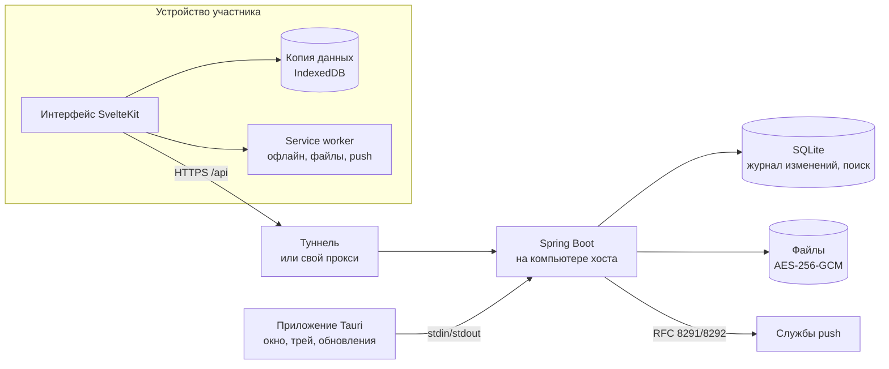
```mermaid
flowchart LR
  subgraph Устройство участника
    UI[Интерфейс SvelteKit] --> IDB[(Копия данных<br/>IndexedDB)]
    UI --> SW[Service worker<br/>офлайн, файлы, push]
  end
  UI -- HTTPS /api --> TUN[Туннель<br/>или свой прокси]
  TUN --> API[Spring Boot<br/>на компьютере хоста]
  SHELL[Приложение Tauri<br/>окно, трей, обновления] -- stdin/stdout --> API
  API --> DB[(SQLite<br/>журнал изменений, поиск)]
  API --> FILES[(Файлы<br/>AES-256-GCM)]
  API -- RFC 8291/8292 --> PUSH[Службы push]
```

## Разработка

```bash
make dev          # бэкенд на :8080 и vite на :5173
make test         # JUnit и Vitest
make lint         # форматирование, javac -Werror, ESLint, Prettier, svelte-check
make e2e          # Playwright против собранного jar
make desktop      # установщик приложения хоста (нужен Rust)
```

Больше 400 тестов сервера (у каждого пакета – свои), Vitest и 25 сценариев Playwright – от первого
запуска до входа по отпечатку. CI на каждый коммит **по-настоящему запускает** приложение на Windows
и macOS. Самая тяжёлая страница – не больше 100 КБ gzip.

Структура и соглашения – в [CLAUDE.md](CLAUDE.md). Коммиты – [Conventional Commits](https://www.conventionalcommits.org/ru/),
интерфейс и ошибки – на русском.

## Лицензия

[GNU AGPL-3.0](LICENSE): пользоваться, менять и разворачивать можно свободно. Запускаете изменённую
версию для других – откройте и её код.
